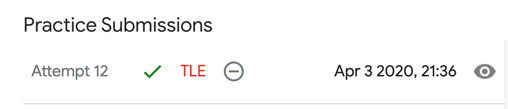

# QR 1. Foregone Solution
* [Foregone Solution](https://codingcompetitions.withgoogle.com/codejam/round/0000000000051705/0000000000088231)

## Problem
```
Someone just won the Code Jam lottery, and we owe them N jamcoins! However, when we tried to print out an oversized check, we encountered a problem. The value of N, which is an integer, includes at least one digit that is a 4... and the 4 key on the keyboard of our oversized check printer is broken.

Fortunately, we have a workaround: we will send our winner two checks for positive integer amounts A and B, such that neither A nor B contains any digit that is a 4, and A + B = N. Please help us find any pair of values A and B that satisfy these conditions.
```
누군가가 코드잼복권에 당첨되었습니다. 우리는 그들에게 N 잼코인을 주어야 합니다. 그런데 커다란 수표를 발행하려고 하는데 문제가 생겼습니다. N은 정수이고 최소한 하나이상의 4를 포함하고 있는데요. 그런데 커다란 수표 프린터의 4키가 고장났습니다.

다행히도 대안이 있습니다. 당첨자에게 두개의 수표를 보낼것입니다. 정수이면서 양수로 된 A, B로 나눌거고 둘 다 4가 포함되지 않도록 말이죠. A+B=N 이 되어야 합니다. 이 조건에 만족하는 A,B 쌍을 찾아주세요.

## 문제 설명
상금을 보내려는데 숫자 4를 찍을 수가 없다고 합니다. 그래서 4가 포함된 상금인 경우 두개로 나눠서 4가 포함되지 않은 상금으로 보내려고 한다고 하네요. 상금 받는 사람들이 좀 이상하게 생각할 수 있겠지만 4를 출력 할 수 없다니 뭐 어쩔 수 없죠 ^^;

## Input Output

Input
```
3
4
940
4444
```

3개의 인풋이 있고, 인풋은 각각 4, 940, 4444 입니다.

Output
```
Case #1: 2 2
Case #2: 852 88
Case #3: 667 3777
```
첫번째 인풋에 대한 답이 2 2, 두번째 인풋에 대한 답이 852 88, 세번째 인풋에 대한 답이 667 3777 이라는 의미입니다.

첫번째 인풋 4에 대한 답이 2 2 라고 하지만 사실 1 3 이나 3 1 도 가능합니다.
두번째 인풋 940에 대한 답도 939와 1도 가능합니다.

## 풀이
### 단순 풀이. 아마도 실패
단순히 생각 해 보면 1씩 빼면서 4가 안들어 있는 것을 구하면 됩니다. 예를 들어 설명하면 4 인 경우 1을 뺀 3 과 1 에 4가 있는지 확인합니다. 없으므로 이 것이 답이됩니다.

940도 마찬가지로 939와 1로 쉽게 구할 수 있습니다.

다만, 4444인 경우는 좀 오래 걸릴 수 있습니다. 1을 뺀 4443과 1에서 양변의 숫자가 4가 있는지 확인 해 본다. 그 다음에는 4442 와 2, 4441 과 3, ... 으로 진행합니다. 4444 같은 케이스에서는 꽤 오래 걸리긴 하겠지만 답이 나오긴 합니다.

이러한 방식은 언젠가는 정답이 나오겠지만 속도가 너무 느려서 통과 하기가 힘들거 같습니다.

한번 코드로 구현해 볼까요?
```python
tc = int(input())

def solve(n):
    for i in range(1, n):
        a = i
        b = n - a

        str_a = str(a)
        str_b = str(b)
        if '4' not in str_a and '4' not in str_b:
            return str_a + " " + str_b


for t in range(1, tc+1):
    n = int(input())
    ans = solve(n)
    print("Case #" + str(t) + ": " + ans)
```



예상한 것 처럼 시간초과했습니다.

### 4를 4보다 작은 아무 숫자로 바꾸고 원래 숫자를 바꾼값으로 빼서 나머지를 구한다
4가 포함 되면 안되니까 4를 다른 숫자로 바꿔주는게 좋겠습니다. 다만 4보다 큰 숫자로 바꾸면 원금보다 커지기 때문에 안됩니다.
4를 4보다 작은 숫자로 바꾸고 원래 숫자와 차이를 구하면 정답이 나올거 같은 느낌적인 느낌! 약간 치트키 같은 느낌이지만 딱히 더 좋은 방법도 떠오르지 않습니다.

약간 치트키 같은 느낌이지만 해법으로는 그냥 상금 금액에서 4를 4보다 작으면서 0 보다 큰 다른 숫자로 바꿉니다. 3, 2, 1 이 될 것입니다. 그 금액과 상금-금액 을 구하면 됩니다. 아주 빠른 시간에 답을 도출 해 낼 수 있습니다.

```python
tc = int(input())

def solve(n):
    a = int(str(n).replace('4', '3'))
    b = n - a
    return str(a) + " " + str(b)


for t in range(1, tc+1):
    n = int(input())
    ans = solve(n)
    print("Case #" + str(t) + ": " + ans)
```

## 정리
* [2019 Google Code Jam QR 1. Foregone Solution 2020.04.03](https://junho85.pe.kr/1493)

## References
* [Google Codejam 2019 - Foregone Solution](https://www.youtube.com/watch?v=ZCSd6kqWZNI)
