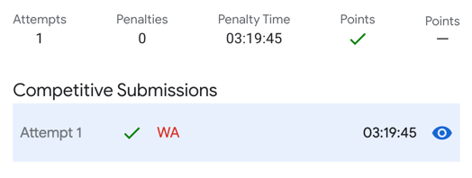

# 2. Nesting Depth (5pts, 11pts)
[Nesting Depth (5pts, 11pts)](https://codingcompetitions.withgoogle.com/codejam/round/000000000019fd27/0000000000209a9f)

## 문제
```
tl;dr: Given a string of digits S, insert a minimum number of opening and closing parentheses into it such that the resulting string is balanced and each digit d is inside exactly d pairs of matching parentheses.

Let the nesting of two parentheses within a string be the substring that occurs strictly between them. An opening parenthesis and a closing parenthesis that is further to its right are said to match if their nesting is empty, or if every parenthesis in their nesting matches with another parenthesis in their nesting. The nesting depth of a position p is the number of pairs of matching parentheses m such that p is included in the nesting of m.

For example, in the following strings, all digits match their nesting depth: 0((2)1), (((3))1(2)), ((((4)))), ((2))((2))(1). The first three strings have minimum length among those that have the same digits in the same order, but the last one does not since ((22)1) also has the digits 221 and is shorter.

Given a string of digits S, find another string S', comprised of parentheses and digits, such that:
* all parentheses in S' match some other parenthesis,
* removing any and all parentheses from S' results in S,
* each digit in S' is equal to its nesting depth, and
* S' is of minimum length.
```

tl;dr too long; didn't read.

괄호 문제
0이면 괄호 없음.
1이면 괄호 한겹. 1 -> (1)
2이면 괄호 두겹. 2 -> ((2))

그런데 여기서는 0과 1로만 나온다.


## 입력
```
4
0000
101
111000
1
```

```
Case #1: 0000
Case #2: (1)0(1)
Case #3: (111)000
Case #4: (1)
```


풀이
```
tc = int(input())

def solve(s):
    result = ""
    is_open = False
    for c in s:
        if c == '0':
            if is_open:
                result += ')'
                is_open = False
            result += c
        else:
            if not is_open:
                result += '('
                is_open = True
                pass
            result += c
    if is_open:
        result += ')'

    return result


for t in range(1, tc+1):
    s = input()
    ans = solve(s)
    print("Case #" + str(t) + ": " + ans)
```

포인트를 얻긴 했는데 실패

Wrong Answer

뭔가 테스트 실패 하는 테스트 케이스가 있다는 말임.

```
Test set 2 (Visible Verdict)
Each character in S is a decimal digit between 0 and 9, inclusive.
```

아하... 더 큰 숫자가 나올 수 있음.

풀이 방법은 종료 후 공개.
