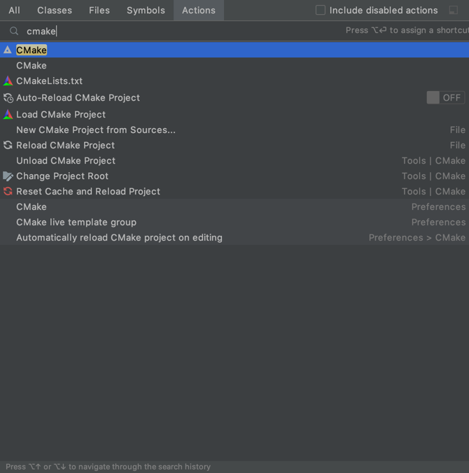
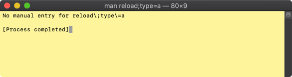
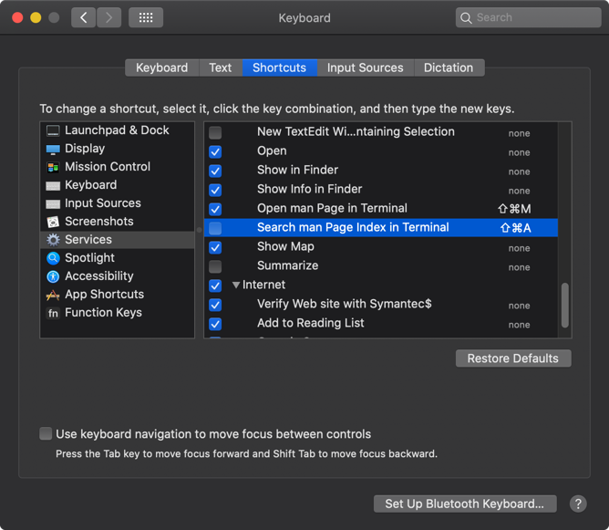

# clion

## Shift + Cmd + A - Find Action 단축키가 OSX 에서 충돌

난 Find Action 을 실행 시키고 싶었는데

뜬금없이 나타난 터미널 창

OSX 업데이트 되다가 Terminal 에서 man 페이지 보는 단축키로 지정 되었기 때문

해제 해 주면 된다.

### References
* [[IntelliJ] Mac에서 IntelliJ CMD+SHIFT+A 눌렀을때 터미널이 켜지는 문제 해결 2019.06.03](https://jojoldu.tistory.com/420)