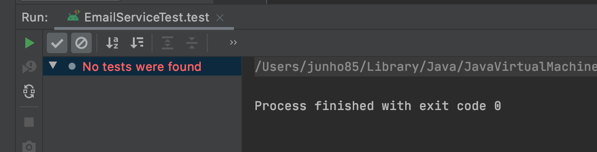
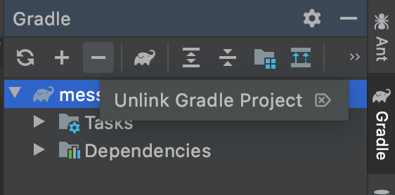
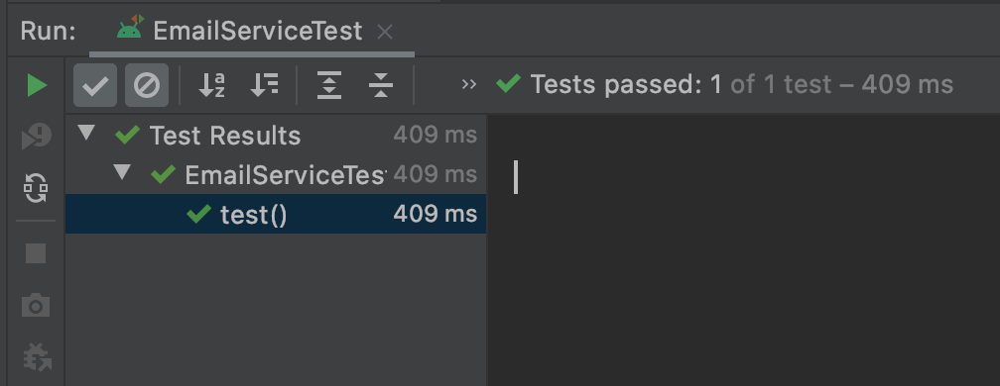
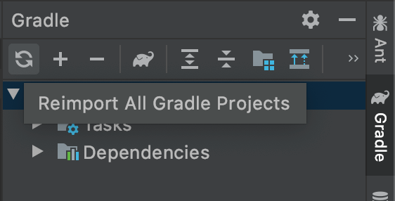

# No tests were found

## Gradle 문제. Spring Boot, JUnit5

갑자기 "No tests were found"가 뜨면서 테스트 실행을 못하게 되었습니다.

Spring Boot 2.2.6, IntelliJ 2020.1 버전입니다. Spring Boot 2.2.6 이기에 기본적으로 JUnit5로 세팅되어 있는 환경이었고요.

중간에 settings.gradle을 건드려서 project name을 바꾸긴 했습니다.

해결 방법은 Gradle설정에서 "-"를 눌러서 "Unlink Gradle Project"해 줍니다.

그리고 IntelliJ를 재시작합니다.

성공!

이상한 점은 "Unlink Gradle Project"후에 "Reimport All Gradle Projects"로는 해결이 안 되었다는 부분입니다.

"Unlink Gradle Project"후에 재시작을 해주어야 했습니다.

2018년 stack overflow의 답변을 참고했습니다. 17.3.3 버전에서도 이런 문제가 있었던 거 같은데요. 여전히 문제가 남아 있나 봅니다. 질문은 좀 달랐지만 해결에 도움이 되었습니다.

### References
* [Unable to make the module: related gradle configuration was not found. Please, re-import the Gradle project and try again](https://stackoverflow.com/a/48571178)

### 정리
* [IntelliJ - "No tests were found" 문제 해결. Spring Boot 2.2.6, JUnit5, Gradle 2020.05.04](https://junho85.pe.kr/1527)
