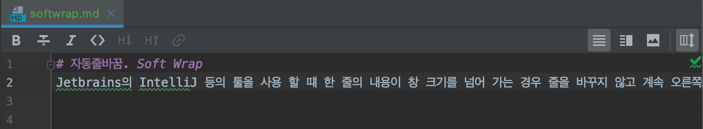
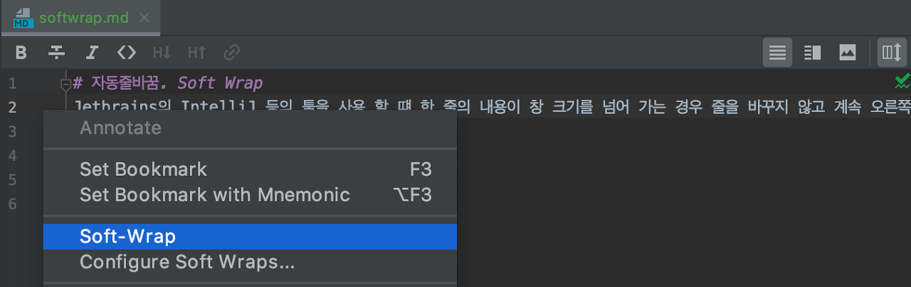
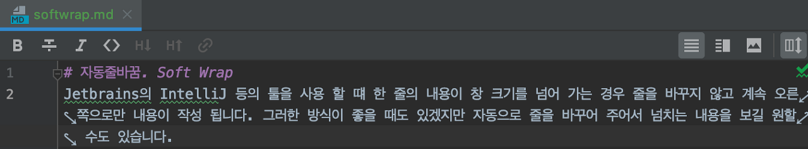
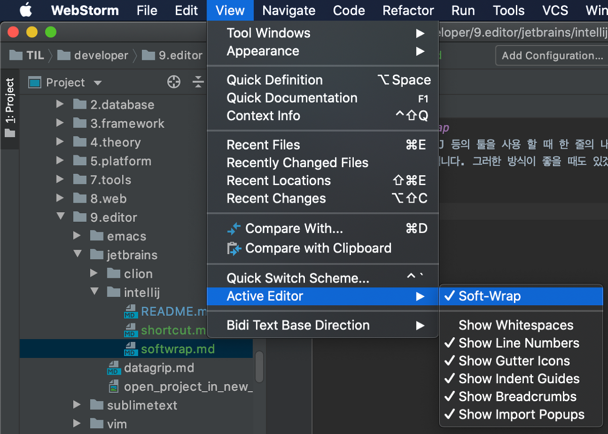
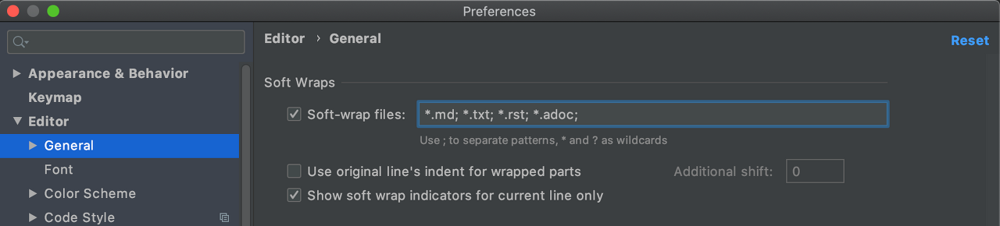

# 자동줄바꿈. Soft Wrap
Jetbrains의 IntelliJ 등의 툴을 사용 할 때 한 줄의 내용이 창 크기를 넘어 가는 경우 줄을 바꾸지 않고 계속 오른쪽으로만 내용이 작성 됩니다.

그러한 방식이 좋을 때도 있겠지만 자동으로 줄을 바꾸어 주어서 넘치는 내용을 보길 원할 수도 있습니다.

## Soft-Wrap 활성화
자동 줄바꿈 기능은 Soft Wrap 이라고 하는데 에디터에서 줄번호 영역을 마우스 우클릭 해서 Soft-Wrap 을 활성화 할 수 있습니다. 아래 그림을 참고 해 주세요.

Soft-Wrap 을 활성화 해 주면 다음과 같이 긴 내용의 글이 창 사이즈에 맞춰서 여러줄로 표시됩니다.

View -> Active Editor -> Soft-Wrap 으로도 똑같이 활성화 해 줄 수 있습니다.

하지만 현재 에디터에서만 해당 기능이 적용 되고 다른 파일을 열거나 해당 파일을 다시 연 경우 해당 기능이 비활성화 됩니다.

모든 파일에 대해 Soft Wrap 적용하기

모든 파일에 Soft Wrap 을 적용하려면 Preferences -> Editor -> General -> Soft Wraps -> Soft-wrap files 을 설정해 주면 됩니다.

Soft-wrap files 의 체크박스를 활성화 시켜 줍니다. 기본 설정으로 *.md; *.txt, *.rst; *.adoc 의 파일들에 대해 자동으로 Soft-wrap 을 적용하도록 되어 있습니다. (*.md 는 확장자가 md 인 모든 파일을 의미합니다.) 여기다가 *.html 등의 파일을 추가해 줄 수 있습니다.

확장자 관계 없이 모든 파일에 대해 Soft Wrap 을 적용시켜 주고 싶다면 * 하나만 적어 주면 됩니다. 모든 파일에 대해 Soft-wrap 을 적용시켜 주겠다는 의미입니다.

## 정리
* [IntelliJ - 자동줄바꿈. Soft Wrap 2020.02.09](https://junho85.pe.kr/1466)