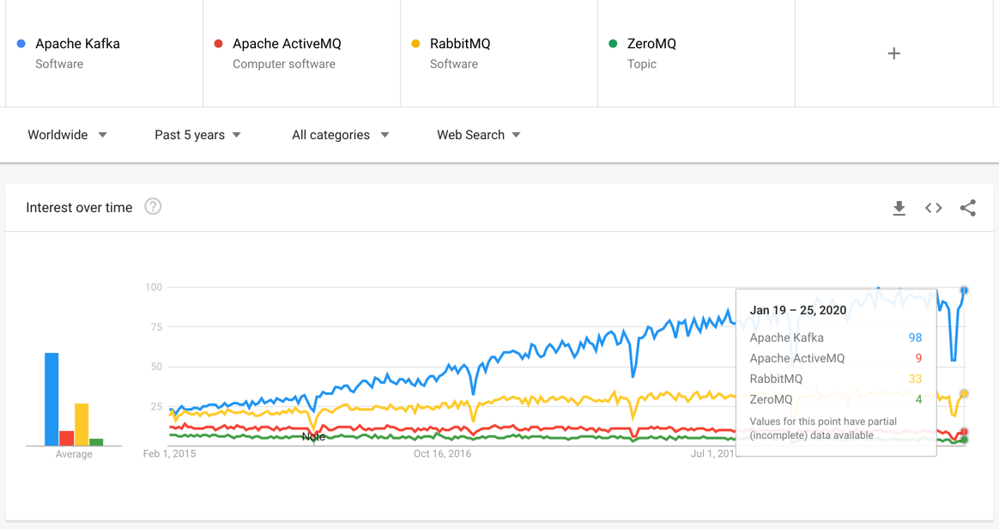

# Message, Queue, etc...

* [RabbitMQ](rabbitmq/README.md)
* [Kafka](kafka.md)
* ActiveMQ
* ZeroMQ

RabbitMQ 와 Kafka 가 많이 쓰이고 있다.

## Trends

## References
* [최신 메시지 큐(Message Queue) MQ 기술 2015.12.18](https://kji6252.github.io/2015/12/18/message-quere/)
  * 메시지 지향 미들 웨어(Message Oriented Middleware: MOM)
  * AMQP(Advanced Message Queueing Protocol)