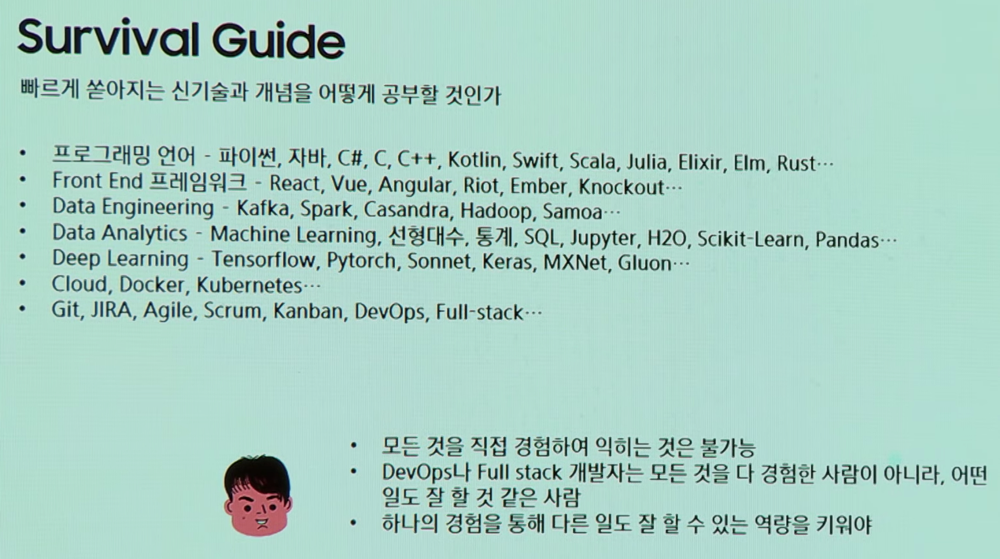
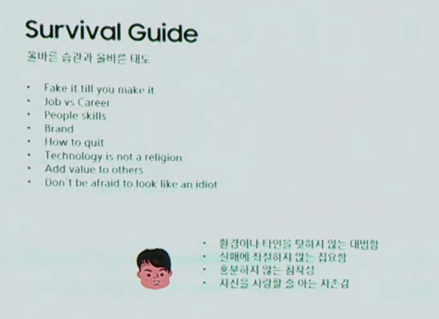
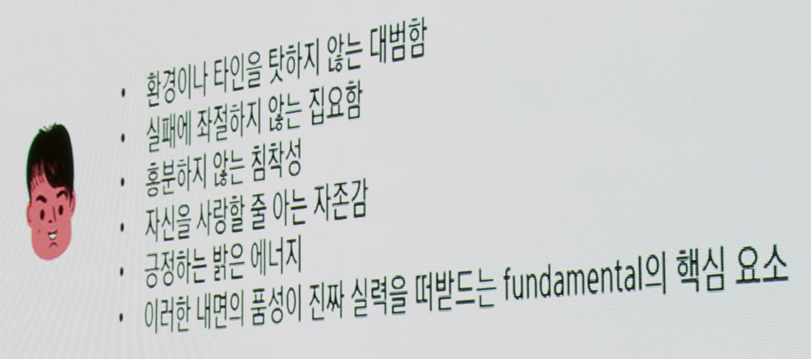
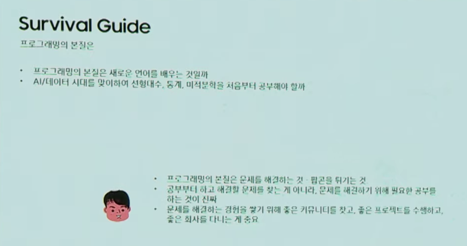

# [Bixby Developer Day 2019: Session] AI, 데이터 시대를 사는 소프트웨어 개발자를 위한 생존 가이드 - 임백준 2019.12.03
* [[Bixby Developer Day 2019: Session] AI, 데이터 시대를 사는 소프트웨어 개발자를 위한 생존 가이드](https://youtu.be/wqA2oVZsaBg)
*  연사: 임백준 상무 / 삼성리서치

### 옛날. 선사시대
* Oracle 7.0 책. 망치 3개 정도 무게
* 잔기술.

### Programming 2.0 르네상스
* [Jeff Atwood](https://twitter.com/codinghorror)
* [Joel Spolsky](https://twitter.com/spolsky)

* stack overflow
* Gamification - 게임화란 문제를 해결하고 사용자를 끌어들이기 위해 게임 디자인의 기술과 방식을 활용하는 것.
* reddit, [digg](https://digg.com), blog, x360 (achievement), ebay

### Humans Need Not Apply - Jerry Kaplan
* 인공지능과 인조노동자의 탄생
* 관리와 통제의 상실, 부의 편중, 일자리 상실
* 무용계급(useless class)의 출현
* 직업대출(job mortgage), 공익지수(public benefit index), 기본소득
* AI의 영향으로부터 개발자도 자유롭지 않음

* [Humans Need Not Apply 2014](https://www.youtube.com/watch?v=7Pq-S557XQU)
* [Jerry Kaplan: "Humans Need Not Apply" | Talks at Google 2015.12.17](https://www.youtube.com/watch?v=hoDxcO2EOHM)

### Andrej Karpathy - Director of AI at Tesla
* Software 1.0 - 컴퓨터에게 파이썬, 자바, C++ 같은 언어를 써서 명령어를 명시적으로 전달해 주는 방식
* Software 2.0 - 뉴럴 네트워크의 웨이트(weights)처럼 사람이 읽을 수 없는 숫자로 컴퓨터에게 할일을 전해주는 방식

* [Andrej Karpathy](https://twitter.com/karpathy)
  * [Software 2.0](https://medium.com/@karpathy/software-2-0-a64152b37c35)
  * 어떤 문제를 풀지 목적. 예측. 추론. 롤 정하기.
  
Software 2.0 공간의 확대
* Autonomous Transportation
* Education
* Employment
* Entertainment
* Healthcare
* Home/Service Robots
* Predictive Policing
* Weapons
* Space Exploration

Software 2.0 시대의 코딩
1. 풀고자 하는 문제와 목적을 설정 (무엇을 예측/분류/추론할 것인가)
2. 컴퓨터가 탐색할 공간을 지정하는 코드의 얼개 작성 (뉴럴넷 아키텍처)

Programming 2.0
2종류의 프로그래머

Software 1.0 개발자
전통적인 코딩을 통해 Software 2.0 개발자가 작업하는 환경, 툴, 분석, 시각화, 인프라 제공

Software 2.0 개발자
데이터 정제, 레이블링, 전처리, 연계 통합, 관리, ML, DL 사용

  
### 2. Survival Guide
Survival Guide

빠르게 쏟아지는 신기술과 개념을 어떻게 공부할 것인가
* 프로그래밍 언어 - 파이썬, 자바, C#, C, C++, Kotlin, Swift, Scala, Julia, Elixir, Elm, Rust...
* Front End 프레임워크 - React, Vue, Angular, Riot, Ember, Knockout...
* Data Engineering - Kafka, Spark, Casandra, Hadoop, Samoa...
* Data Analytics - Machine Learning, 선형대수, 통계, SQL, Jupyter, H2O, Scikit-Learn, Pandas...
* Deep Learning - Tensorflow, Pytorch, Sonnet, Kera, MXNet, Gluon...
* Cloud, Docker, Kubernetes...
* Git, JIRA, Agile, Scrum, Kanban, DevOps, Full-stack...

* 발표자
  * 모든 것을 직접 경험하여 익히는 것은 불가능
  * DevOps나 Full stack 개발자는 모든 것을 다 경험한 사람이 아니라, 어떤 일도 잘 할 것 같은 사람
  * 하나의 경험을 통해 다른 일도 잘 할 수 있는 역량을 키워야

Fundamental 을 공부하라
* 유행하는 프레임워크나 API의 수명은 길어야 3년
* 객체지향, 함수형, TDD, 리팩토링, 패턴 등 원리와 패러다임은 10년 이상
* 학력, 경력, 직책, 나이, 성별, 종교, 인종, 재산, 미모... 모든 껍질을 떼고 남은 인간 자체의 문제 해결 능력은 평생

Fundamental 을 공부하는데 70%

* 발표자
  * Clean Code, Code Complete, Programming Pearl, Design Patterns, The Mythical Manmonth 등 개발자들의 필독서는 습관과 태도에 대한 이야기
  * 문제 해결 능력을 키우는 것은 습관과 태도의 문제로 귀결
철학적인 고민

문제 해결 능력은 ... 습관과 태도...

올바른 습관과 태도에 관련된 이야기

올바른 습관과 올바른 태도
* Fake it till you make it
* Job vs Career
* People skills
* Brand
* How to quit
  * positive 로 이직 하라
    * 더 좋은 동료
    * 더 좋은 프로젝트
    * 높은 연봉
  * negative 로 이직 하면 더 나쁜 negative 를 겪을 수 있다.
    * 동료랑 안맞아서 등
* Technology is not a religion
* Add value to others
* Don't be afraid to look like an idiot (없어 보여도 괜찮다)

* 발표자
  * 환경이나 티인을 탓하지 않는 대범함
  * 실패에 좌절하지 않는 집요함
  * 흥분하지 않는 침착성
  * 자신을 사랑할 줄 아는 자존감
  * 긍정하는 밝은 에너지
  * 이러한 내면의 품성이 진짜 실력을 떠받드는 fundamental의 핵심 요소

멘토는 없다
* 정보에 대한 접근의 평준화 및 급변하는 기술 때문에 자기 경험을 도움이 되는 방식으로 후배에게 전수해줄 선배가 존재하지 않음
* 스스로 마음을 일으켜 공부하는 것이 중요
* 정해진 길이 없으며 각자 가는 길이 모두 맞는 길
* 누구에게 배우는 것이 아니라 누구를 가르치는 게 더 좋은 공부

* 발표자
  * 공부는 혼자 하는 것보다 여러 사람이 함께 하는 것이 좋으며
    * 배우는 것 보다 가르치는게 더 공부가 된다.
  * 자기가 공부하려는 내용을 회사의 일과 일치시키는 것이 가장 효과적
    * 회사에서는 일하고 집에 가서 자기 하고 싶은거 하면 오래 가기 어려움. 회사에서 일로서 할 수 있도록 만드는 것이 좋다.

[Cassie Kozyrkov](https://twitter.com/quaesita) - Chief Decision Scientist at Google
중요한 것은 물 분자의 회전이 아니라 팝콘을 튀기는 것이다.
팝콘 튀기는데 전자공학 공부할 필요는 없다.

프로그래밍의 본질은
* 프로그래밍의 본질은 새로운 언어를 배우는 것일까
* AI/데이터 시대를 맞이하여 선형대수, 통계, 미적분학을 처음부터 공부해야 할까

* 발표자
  * 프로그래밍의 본질은 문제를 해결하는 것. 팝콘을 튀기는 것
  * 공부부터 하고 해결할 문제를 찾는 게 아니라, 문제를 해결하기 위해 필요한 공부를 하는 것이 진짜
  * 문제를 해결하는 경험을 쌓기 위해 좋은 커뮤니티를 찾고, 좋은 프로젝트를 수행하고, 좋은 회사를 다니는 게 중요
  

## References
* [개발자를 위한 생존가이드](https://velog.io/@qkrcndtlr123/%EA%B0%9C%EB%B0%9C%EC%9E%90%EB%A5%BC-%EC%9C%84%ED%95%9C-%EC%83%9D%EC%A1%B4%EA%B0%80%EC%9D%B4%EB%93%9C)
* [Bixby developer day 2019 후기](https://medium.com/@trialxxerror/bixby-developer-day-2019-%ED%9B%84%EA%B8%B0-ba18348ae9da)