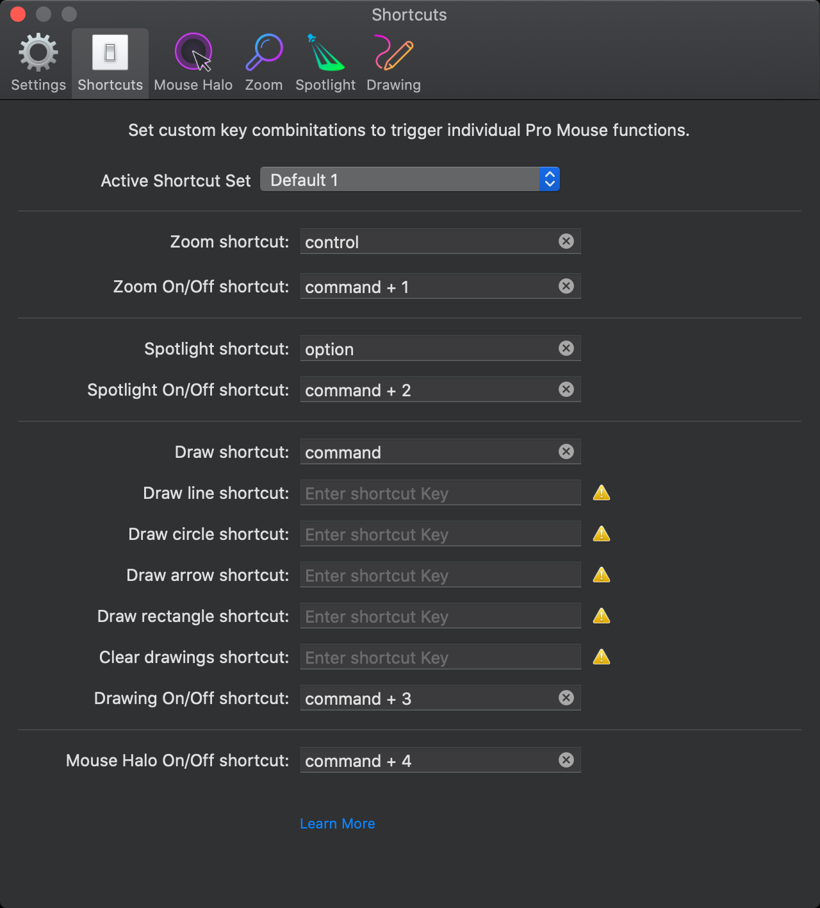

= OSX - Utilities

== Pro Mouse
2020.08.14 구입함

그럭저럭 괜찮음

=== 단축키 설정1
단축키는 cmd + 1, 2, 3, 4 로 Zoom, Spotlight, Drawing, Halo 켜고 끌 수 있도록 했음

사용은
Zoom: control
Spotlight: option
Draw: command

=== 단축키 설정2
Spotlight를 더 많이 쓸거 같아서 Spotlight, Zoom, Drawing, Halo 로 변경

사용은
Spotlight: control
Zoom: option
Draw: command

=== 개선했으면 하는 부분
종종 단축키가 제대로 안먹는 경우가 있음. command + tab 하고 나서 부터 안되는 거 같음.

각 모드가 켜지고 꺼질때 쉽게 확인 할 수 있는 방법이 있으면 좋겠음
-> Show local notifications 켜면 그나마 나음. 이런거 일단 기본 켜져 있고 끌 수 있게 하는게 낫지 않을까?

단축키를 F1, F2 같은 키도 사용 할 수 있도록 하면 좋겠음. 그런데 요즘 맥북 기본 키보드에 없어서 일부러 뺀 걸 지도 모르겠음.

드로잉 모드가 키 누르고 마우스 이동 하면 그려지는건데 익숙하지 않음. 그냥 활성화 하고 나면 마우스 클릭 할 때 그려지는게 낫지 않나?

== Cursor Pro
https://www.ixeau.com/apps/cursor-pro

https://www.ixeau.com/apps/cursor-pro $7.99

== Mousepose
https://boinx.com/mousepose/

1년에 US$9.99 13,743₩ (2020.08.14 기준)

그런데 클릭후 퍼지는 효과가 늦게 발생 하는게 좀 아쉬움. 누르자 마자 퍼지고 사라지는게 좋을거 같음

Keystrokes 같은 경우도 한글로 입력 했다고 해도 영어로 나오면 좋겠음. 그리고 대문자 같은거 입력 할 때 순간적으로 shift 눌려 있던거도 자꾸 인식 되는데 이런건 안나와도 될 듯. 특별한 커맨드도 아닌데 굳이 나올 필요가 없음.

== pinpoint
https://lagentesoft.com/pinpoint/

7-day Trial (2020.08.14 받아 보니 업데이트 하라고 하고 안됨)

앱스토어 $3.99

=== References
https://bedreams.tistory.com/46[프리젠테이션을 위한 최고의 보조 프로그램, Mousepose 2016?]

https://www.clien.net/service/board/cm_mac/13557919[mousepose 앱이 업데이트됐네요]
