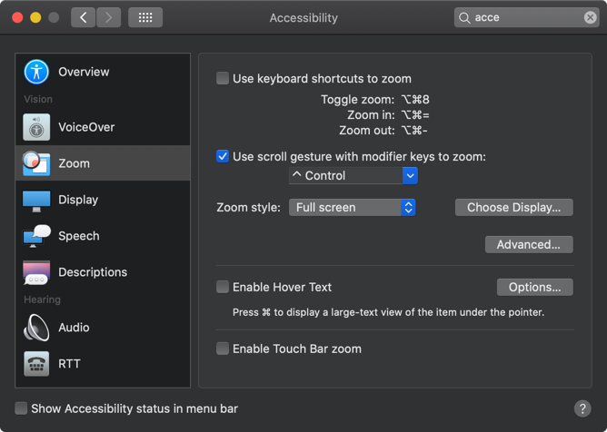
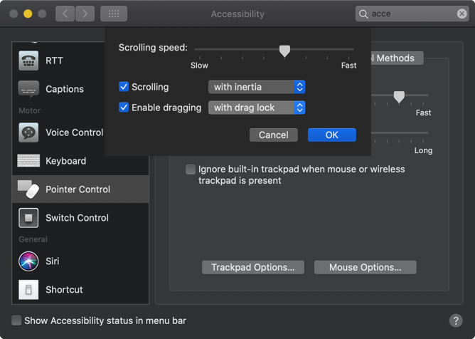

# 맥북 초기 세팅
## 직접 설치
* chrome, 크롬
  * 기본 브라우저로 설정
  * brew 로도 설치 가능
  
## Homebrew 가 있으면 대부분의 앱은 쉽게 설치 가능
* homebrew
  * brew 설치 하고 대부분 brew 로 설치하면 편하다.
  * https://brew.sh/
```
/usr/bin/ruby -e "$(curl -fsSL https://raw.githubusercontent.com/Homebrew/install/master/install)"
```

### iterm2 - terminal 프로그램
```
brew install Caskroom/cask/iterm2
```

### specatacle - 단축키로 창 위치/사이즈 조정
```
brew cask install spectacle
```

### sourcetree
```
brew cask install sourcetree
```

### atom
```
brew cask install atom
```

### jetbrains-toolbox
* [jetbrains toolbox app](https://www.jetbrains.com/toolbox/app/)
* https://formulae.brew.sh/cask/jetbrains-toolbox
```
brew cask install jetbrains-toolsbox
```


### 터미널 커맨드, 개발환경 관련
```
brew install wget
brew install jq
brew install tig
brew install git git-lfs
brew install fzf
brew install fasd
brew install ruby
```

```
brew cask install ngrok
```
https://ngrok.com/

### asciinema
```
brew install asciinema
```
https://asciinema.org/

```
asciinema rec
```

### neofetch
```
brew install neofetch
```


### vim 관련
```
brew install neovim
```

spacevim - 여러 플러그인 설치. 처음 시작시 1
```
curl -sLf https://spacevim.org/install.sh | bash
```

### tmux 관련
```
brew install tmux
```


```
git clone https://github.com/gpakosz/.tmux.git
ln -s -f .tmux/.tmux.conf
cp .tmux/.tmux.conf.local .
```


```
vi .tmux/.tmux.conf.local
```
아래 처럼 몇가지 설정 주석 해제
```
# increase history size
set -g history-limit 10000

# start with mouse mode enabled
set -g mouse on

# force Vi mode
# really you should export VISUAL or EDITOR environment variable, see manual
set -g status-keys vi
set -g mode-keys vi
```

tmuxinator
```
brew install tmuxinator
```

ruby 설치 되어 있으면 gem 으로도 설치 할 수 있는데 path 를 못잡아 주는듯
```
gem install tmuxinator
```


### evernote
```
brew cask install evernote
```

### slack
```
brew cask install slack
```

### sublime
```
brew cask install sublime-text
```

## App Store
### kakao talk
* keyboard alert 설정 - 이미 되어 있음

### automute
* 헤드셋을 뽑았을 뿐인데 사무실의 적막을 깨는 경험을 여러번 했다면 필수
* Mac App Store 에서 다운받아야됨. 언젠가 부터 $2.99 로 유료화 된듯?

### automute
* [](https://formulae.brew.sh/cask/automute)
```
brew cask install automute
```
* [](https://github.com/Lorenzo45/AutoMute)
  * Mute or unmute your MacBook based on your current Wi-Fi network

## 기타
* oh-my-zsh

### docker
* [](https://docs.docker.com/docker-for-mac/install/)

### httpd
```
brew install httpd
```
https://formulae.brew.sh/formula/httpd

## perlbrew
* [perlbrew](https://perlbrew.pl/)

* 정리
  * [perl - perlbrew 로 여러 버전의 perl 사용하기 2017.11.27](https://junho85.pe.kr/737)

## zoom

Accessibility -> Zoom -> Use scroll gesture with modifier keys to zoom

## touch drag lock

Accessibility -> Pointer Control -> Mouse & Trackpad -> Trackpad Options... -> Enable dragging -> with drag lock

## telnet
```
brew install telnet
```

## handbrake
```
brew install handbrake
```
이건 HandBrakeCLI 설치 되는거 같음.


```
brew cask install handbrake
```
* [](https://formulae.brew.sh/formula/handbrake)


* VPN
* wunderlist
* arduino ide

* android studio
* xcode
* telegram


* telegram
* onenote
* office
* home, end 키 세팅

* TistoryEditor
* screen saver - hot corner


데이터 가져오기

OSX
http://openwiki.kr/tech/osx


iterm
Preferences -> Profiles -> Session 에서 Always prompt before closing 을 해 두는 것이 좋다.
tab 이 command + w 로 그냥 닫히면 암울...


## References
* [Mac OS 초기 세팅 (개발용 세팅)](https://snowdeer.github.io/mac-os/2018/11/02/mac-init-setting/)
* [본격 macOS에 개발 환경 구축하기 2017.11.22](https://subicura.com/2017/11/22/mac-os-development-environment-setup.html)