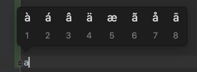

# key
## repeating 안먹을때
키를 꾹 눌렀을 때 반복 입력이 안되고

이런식으로 나온다면 터미널을 열고 다음 명령얼르 실행시켜 준다.
```
defaults write -g ApplePressAndHoldEnabled -bool false
```

### References
* [How to Enable Key Repeating in macOS 2016.08.19](https://www.howtogeek.com/267463/how-to-enable-key-repeating-in-macos/)

## karabiner - 키 맵핑
* [](https://formulae.brew.sh/cask/karabiner-elements)
```
brew cask install karabiner-elements
```
* all
  * capslock as esc
* 외장 키보드 각각
  * 
* 정리
  * [macOS Sierra 한영키로 한영전환하기. 106키 키보드에서 2017.04.30](https://junho85.pe.kr/578)
  * [macOS Sierra 에서 ₩ 입력을 ` 로 바꾸기. KeyBindings. Home, End, PageUp, PageDown 등 2017.04.30](https://junho85.pe.kr/580)

## 한영키 세팅
* [macOS Sierra 한영키로 한영전환하기. 106키 키보드에서](https://junho85.pe.kr/578)

## keyboard 자동변환 중단시키기
### 정리
* [맥북 세팅 - Keyboard - Text 자동 전환 해제 2020.01.09](https://junho85.pe.kr/1457)

## opt arrow

bash 인 경우 ~/.inputrc
```
"\e\e[D": backward-word
"\e\e[C": forward-word
```

zsh 인 경우 ~/.zshrc
```
"\e\e[D": backward-word
"\e\e[C": forward-word
```

iterm 키 맵 설정에 따라 다를 수 있음. 안되면 다음처럼
```
bindkey -e
bindkey '^[[1;9C' forward-word
bindkey '^[[1;9D' backward-word
```

그런데 나 같은 경우 tmux 에서 opt arrow 를 pane 이동에서 사용 하고 있어서 쓸수가 없음. 다른 적당한 키 뭔가 없을까. 

### 정리
* [osx iterm 에서 option 화살표 사용하기 (단어 단위 점프) 2016.04.13](https://junho85.pe.kr/451)

### References
* [iterm에서 zsh 사용할 때 `Opt + 방향키` 설정하기 2016.04.10](https://edykim.com/ko/post/setting-opt-direction-keys-when-using-zsh-in-iterm/)
* [How can I get control+left arrow to go back one word in iTerm2?](https://superuser.com/questions/357355/how-can-i-get-controlleft-arrow-to-go-back-one-word-in-iterm2)