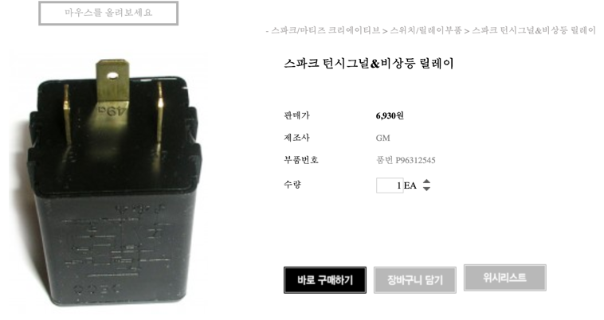
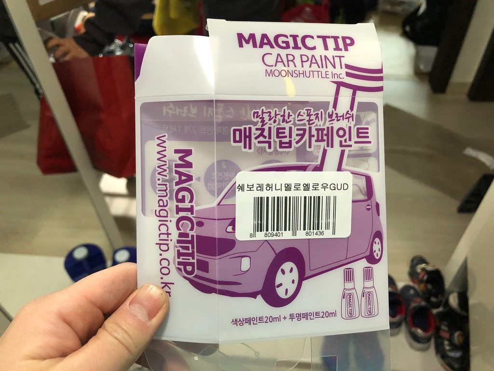
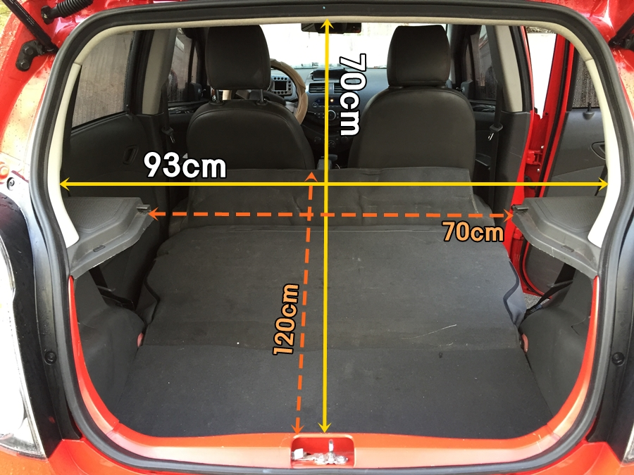

# 쉐보레 스파크
* 허니멜로옐로우 GUD
* [2013 스파크 허니멜로 옐로우! 스파크 노랑이 실물 직찍! 2012.12.20](https://blog.gm-korea.co.kr/3236)

## 브레이크등
* [쉐보레 스파크 마티즈크리에이티브 테일램프 브레이크 전구 더블 94535564](https://coupa.ng/bnh3NG)
  * 2020.01.26 기준 1200원
* 교체
  * 십자드라이버 필요
  * 트렁크 열고 나사 풀고 램프 유닛? 을 당겨서 빼냄
  * 제일 위쪽 돌려서 빼내고 전구 교체
  * 다시 조립
  
* [아베오 브레이크등 교체방법(DIY,자가정비,직접교체,전구규격) 2019.07.15](https://myride.tistory.com/462)
  * 전구를 소켓에 넣을 때 손에 있는 땀이나 유분, 수분 등이 전구 유리 표면에 뭍지 않도록 주의 (깨끗한 장갑을 끼고 작업 권장)
  * 전구 유리 표면이 오염되면 전구 수명이 단축되기 때문

## 번호판등 전구
* [쉐보레 스파크 번호판등 전구 13505773](https://coupa.ng/bkPRIo)
  * 2020.01.27 기준 1200원

## 실내등
* [쉐보레 순정품 스파크 마티즈크리에이티브 실내등 전구 11030669](https://coupa.ng/bkPRCt)
  * 2020.01.27 기준 1300원

## 스파크 턴시그널&비상등 릴레이

* [스파크 턴시그널&비상등 릴레이](http://www.c-mall.co.kr/shop/shopdetail.html?branduid=117416&xcode=042&mcode=016&scode=&type=X&search=&sort=order)
  * 부품번호 P96312545
  * 판매가 6,930원 + 3000원 = 9930원
  * 방향지시등, 비상등 깜빡이 똑딱똑딱 소리 안나면서 불도 안들어 올 때 교체해주면 될 듯 (불은 들어 오고 소리만 안나오는 경우도 있는듯?)
  * 교체방법?
    * [마티즈 크리에이티브 깜빡이 릴레이 소리로 무작정 뜯어보기 (스파크도 비슷할 듯) 2013.09.29](https://m.blog.naver.com/comboybox/80198871603)
    * [쉐보레 홍성서비스 + 스파크 턴시그널 릴레이 교환 및 엔진경고등 소거. 2018.03.02](https://www.tisdory.com/2891)
      * 엔진체크등 소거도 확인
      * 18,000원
* [96312545](http://itempage3.auction.co.kr/DetailView.aspx?itemno=B528701902) 7400원
* [쉐보레 순정품 스파크 마티즈 크리에이티브 턴시그널 비상등릴레이 96312545](https://coupa.ng/bkPPcM) 7400원 + 2500원
  * 2020.01.26 기준 9200 + 2500

## 페인트

* [매직팁카페인트 쉐보레(GUD) (색상1개+투명1개)](https://coupa.ng/bnh7wj) 2020.01.26 기준 12800원
* [쉐보레 스파크 GUD (주문생산컬러) 허니멜로우옐로우 붓펜 자동차 차량용 카 페인트](https://coupa.ng/bnh7PZ) 2020.01.26 기준 12000원

## 뒷좌석 공간
 
 출처:  

* 트렁크 입구
  * 가로 70~93cm
  * 세로 70cm
* 뒷좌석 접은 공간
  * 깊이: 120cm (앞좌석도 최대한 당기면 55인치 TV 겨우 들어감)

뒷좌석 발판쪽은?