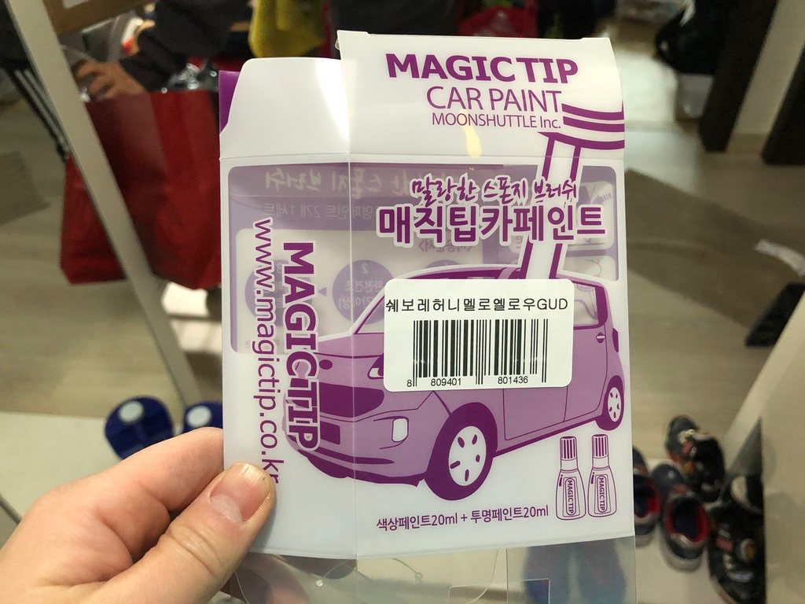
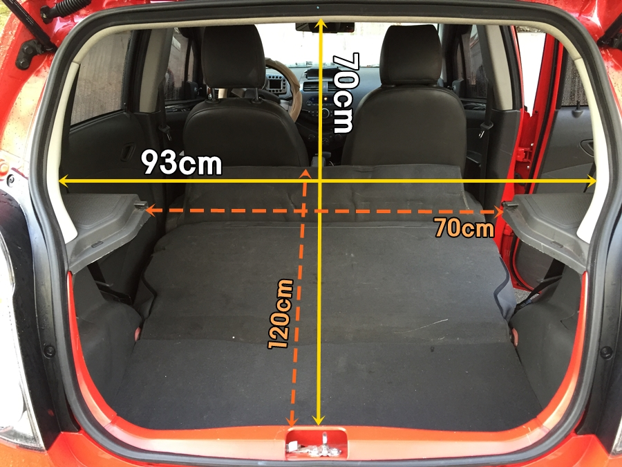

= 쉐보레 스파크

* 허니멜로옐로우 GUD
* https://blog.gm-korea.co.kr/3236[2013 스파크 허니멜로 옐로우! 스파크 노랑이 실물 직찍! 2012.12.20]

== 페인트

* https://coupa.ng/bnh7wj[매직팁카페인트 쉐보레(GUD) (색상1개+투명1개)] 2020.01.26 기준 12800원
* https://coupa.ng/bnh7PZ[쉐보레 스파크 GUD (주문생산컬러) 허니멜로우옐로우 붓펜 자동차 차량용 카 페인트] 2020.01.26 기준 12000원

== 뒷좌석 공간

출처: https://blog.naver.com/unique8857/220279887401[마티즈 크리에이티브 (스파크) 트렁크 입구 사이즈]

* 트렁크 입구
** 가로 70~93cm
** 세로 70cm
* 뒷좌석 접은 공간
** 깊이: 120cm (앞좌석도 최대한 당기면 55인치 TV 겨우 들어감)

뒷좌석 발판쪽은?
