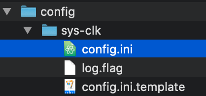

= 오버클럭

== Atmosphere, Atmosphère

https://github.com/Atmosphere-NX/Atmosphere/releases

== sys-clk
Atmosphere가 있어야 한다.

https://github.com/retronx-team/sys-clk[sys-clk]

sys-clk-overlay는 Tesla가 있어야 함.

https://github.com/retronx-team/sys-clk/releases 에서 다운로드

switch
config
atmosphere

디렉토리가 있음

image::image-2020-10-05-09-28-23-625.png[]

config/sys-clk/config.ini

https://github.com/retronx-team/sys-clk-db 에 설정 셈플들 있음

----
; Minecraft
; Better Framerate
[0100D71004694000]
handheld_cpu=1224
handheld_mem=1600
----

샘플은 휴대모드 설정에 cpu랑 mem clock 정도만 높이는데 dock모드에서 2인 이상 플레이 하면 느려져서 dock모드를 좀 더 끌어 올려 보았다. 덤으로 충전 모드에서도 좀 올려봄.
----
; Minecraft
; Better Framerate
[0100D71004694000]
docked_cpu=1785
docked_gpu=844
docked_mem=1600

handheld_cpu=1224
handheld_mem=1600

handheld_charging_cpu=1785
handheld_charging_gpu=844
----

TitleID 찾는 방법
https://switchbrew.org/wiki/Title_list/Games

https://github.com/Sun-Research-University/sys-clk-Editor/releases[sys-clk Editor]

== References

https://opencourse.tistory.com/236[스위치 9.0.1 홈브류 sys-clk - 스위치 봉인해제!! 오버클럭과 언더클럭 2019.12.03]

https://m.blog.naver.com/eath96/221859350012[새 닌텐도 스위치 모드로부터 CPU와 GPU 및 온도 상태 알아내기 2020.03.18]

* CPU : 앤비디아 테그라 X1+ T210B01
* GPU : 앤비디아 GM20B
* RAM : LPDDR4X SDRAM 4GB
* 네트워크 : 2.4GHz/5GHz가 802.11ac까지 지원됨. 블루투스 4.0

https://www.thegamingman.com/nintendo-switch-learn-how-to-enable-boost-mode-the-easy-way/[Nintendo Switch How To Enable Boost Mode!]

https://gbatemp.net/threads/sys-clk-under-overclocking-sysmodule.531372/[sys-clk
a per-title CPU, GPU and RAM overclock and underclock sysmodule for Atmosphère]

https://opencourse.tistory.com/466
