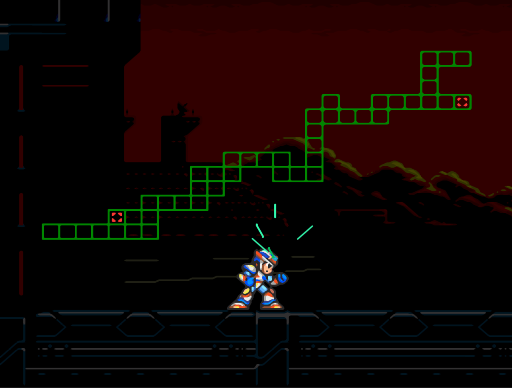
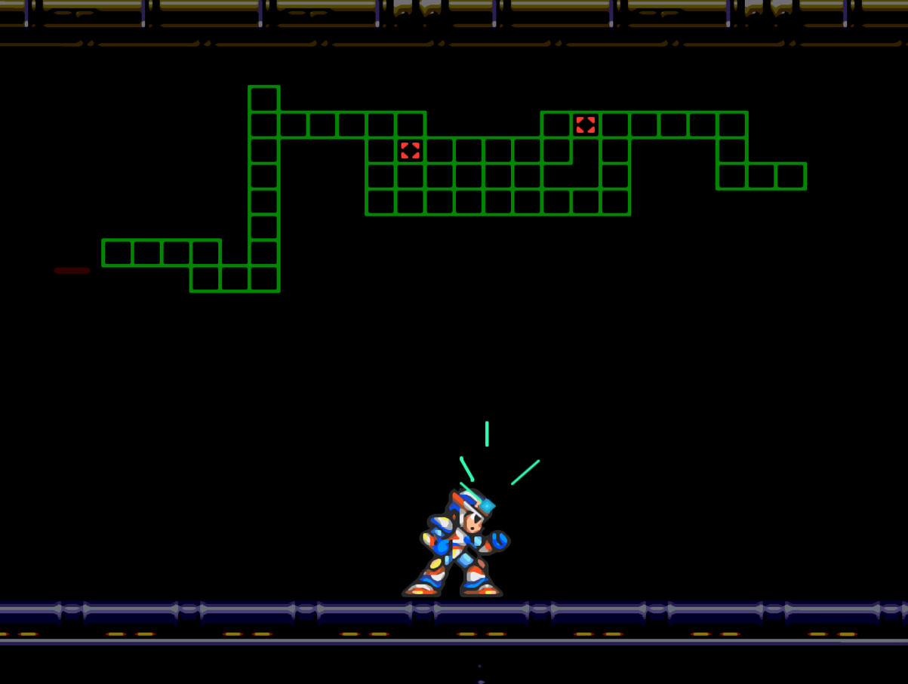
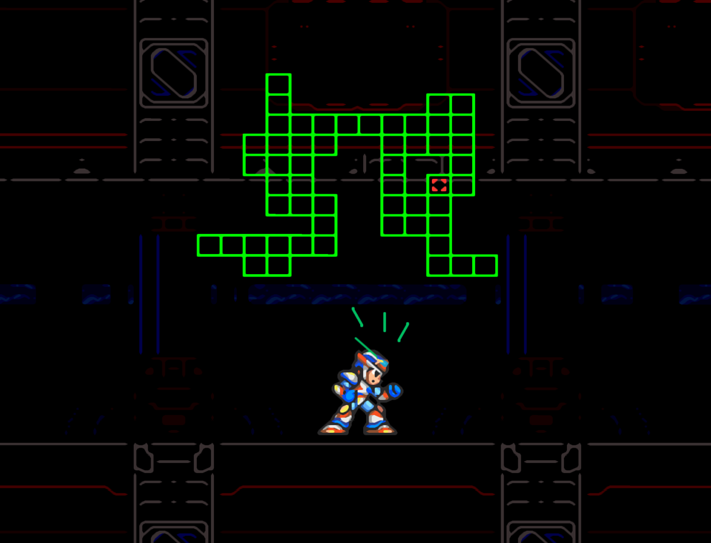
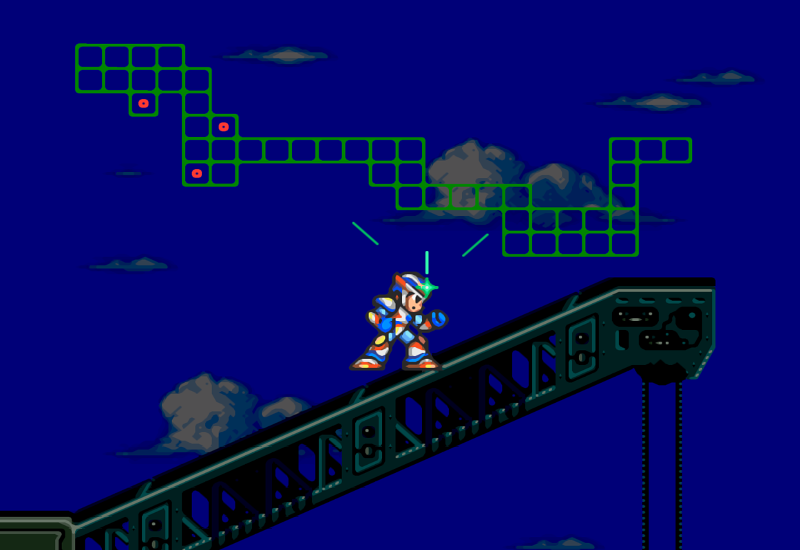
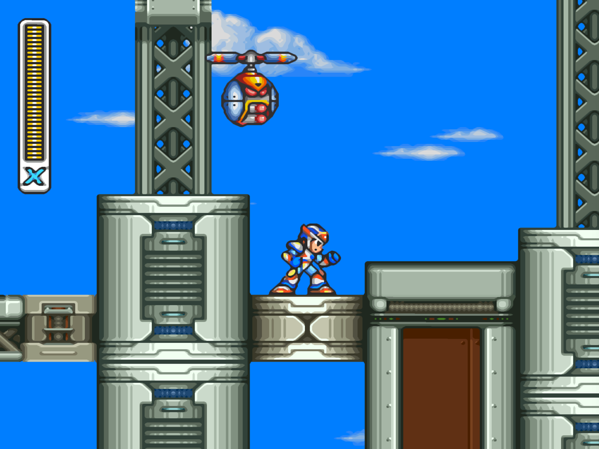
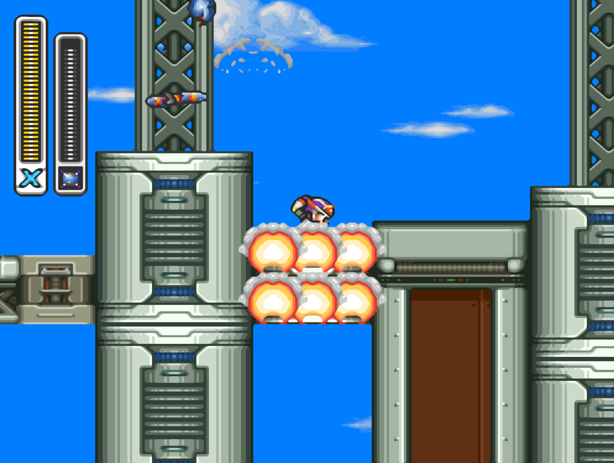

# rockman x 3

## 순서
* 2. 버팔로 가서 다리 파츠 얻고 돌아가서 서브탱크 먹고 버팔로 잡고 프로스트 실드 얻는다.
* 7. 코뿔소 가서 서브탱크 먹는다. 벽만드는 건 프로스트 실드 한방에 해결 가능. 드릴무기 토네이도팽을 얻는다. 2버팔로 가서 토네이도팽으로 얼음깨서 하트 먹는다.
* 


## 1. BLAST HORNET
* 스페셜파츠: 오른쪽 위 가시 때문에 못감. 다리 파츠로 갈수는 있지만 좀 위험한편.
```
DR.LIGHT: Enter this capsule, X. Install this Energy Chip. This chip will allow you to recover energy.
Stand still and your energy level will slowly increase.
Remember X, your system can handle only 1 of the 4 enhancement chips.
Enter this capsule only if you are sure you want to use this chip.
X, you do not yet have the part this chip will be installed in.
Please return after you find it.
```
* 중간보스: 레이저 별 모양 적
  * 약점: 애시드 러시
* 라이드아머: 드릴로 뚫고 내려가면 라이드 아머 있음. 이거 구하고 나면 라이드 아머 소환 가능해짐
* 짐 싣는 비행기
  * 라이드아머 타고 가면 안나오나? 구하고 나면 안나오나?
  * 나오면 짐 몇개 부수면 떠남
* ❤️하트: 다리 파츠로 올라가면 먹을 수 있음
* 보스: 벌
  * 약점: GRAVITY WELL
  * 무기: PARASTIC BOMB

## 2. BLIZZARD BUFFALO
* ❤️하트: 토네이도 팽으로 얼음 부수고 내려가서 먹는다.
* 🔋서브탱크: 건물 밖으로 나오면 좌측 상단에 있는데 다리 파츠 업그레이드 하고 와서 먹는다.
* 파츠: 다리파츠. 대쉬점프 잘 하면 되는데 어려우면 제로로 대쉬점프 하면 좀 더 쉽다. 제로가 덩치가 크기 때문.
```
Enter this capsule, X.
Take this Leg upgrade.
The upgrade will enhance your mobility in the air.
You will be able to dash left, right or even straight up into the air.
```
* ❤️하트: 어디 있지
* 보스: 버팔로
  * 약점: ?
  * 꼼수: 앞에서 점프 하면 자꾸 뒤로 갔다 박음
  * 무기: FROST SHIELD

## 3. GRAVITY BEETLE

* ❤️하트: 벽으로 막혀 있음
  * 벌 보스 클리어 하고 나면 뚫려 있음.
* 라이드아머F: 다리 파츠 업그레이드 필요
* 벽 뚫으면 뭐 있지?
* 보스:
  * 약점: 레이
  * 무기: GRAVITY WELL. 벌의 약점

## 4. TOXIC SEAHORSE


* ❤️하트: 왼쪽 벽 타고 올라가면 쉽게 먹을 수 있음
* 라이드아머K: 프로스트실드 풀차지하면 물속에서 얼음 만들어서 타고 올라갈 수 있음. 라이드아머F 타고오른쪽 끝까지 가서 물 위 점프 하면서 갈 수 있으나 좀 번거로움  
* 중간보스: 오징어
  * 벽에 붙어서 딱총 연사 하면 금방 잡을 수 있음
* 보스:
  * 약점: FROST SHIELD
  * 무기: ACID BURST

## 5. VOLT CATFISH

* ❤️하트: 위로 올라가는거 타고 왼쪽으로 빠지지 말고 계속 올라가서 오른쪽으로 빠지면 됨
* 파츠: 아머파츠.
  * 위로 올라가는거 타고 오른쪽으로 빠지지 말고 계속 올라가서 왼쪽으로 빠지면 뭔가 있음.
  * 암파츠가 있어야 하고 GRAVITY WELL 차지샷 쏘면 기구가 올라감
  * 네온점프로도 올라갈 수 있음.
```
DR.LIGHT
Enter this capsule, X.
Take this Armor upgrade.
The upgrade will decrease the damage done to your systems.
As you receive damage, a defense field will be generated to protect you.
```
* 🔋서브탱크: 위로 올라가서 라이드아머 타고 내려가면 바닥 부서지고 내려가면 서브탱크 먹을 수 있음 
* 보스:
  * 약점: 드릴무기. 토네이도팽
  * 무기: TRIAD THUNDER - 쉬림퍼의 약점

## 6. CRUSH CRAWFISH - 쉬림퍼
* SCISSORS SHRIMPER


* 라이드아머H: 초반에 트라이어드 썬더 차지샷 쏘면 바닥 부숴짐


* ❤️하트: 라이드아머 타고 가다가 내려가는 길에서 오른쪽 벽 깨고 들어가면 있음
* 스페셜파츠: 
```
DR.LIGHT: Enter this capsule, X.
Install this Body Chip.
This chip will increase your defensive ability.
Your defense shields will be enhanced and you will receive even less damage.
Remember X, your system can handle onaly 1 of the 4 enhancement chips.
Enter this capsule only if you are sure you want to use this chip.
X, you do not yet have the part this chip will be installed in.
Please return after you find it.
```
* 보스
  * 약점: 트라이어드 썬더
  * 무기: SPINNING BLADE


## 7. TUNNEL RHINO
* ❤️하트: 암파츠랑 메기무기인 TRIAD THUNDER 전기 무기 차지샷 쏘면 돌이 떨어짐
* 🔋서브탱크: 오른쪽 위에 쉽게 먹을 수 있음
* 파츠: 
  * 암파츠랑 메기무기인 TRIAD THUNDER 전기 무기 차지샷 쏘면 돌이 떨어짐
```
DR.LIGHT: Enter this capsule, X.
Take this Sensor upgrade for your helmet.
The upgrade will help you to find hidden items based on the satellite readings.
You should be able to tell the exact location of items using its ground-penetrating radar.
```
* 중간보스: 몸통 분리 되는 탱크
* 보스:
  * 약점: ACID BURST
  * 무기: TORNADO FANG - 벽 뚫을 때 사용함.

## 8. NEON TIGER
* 🔋서브탱크: 오른쪽 위쪽. 잠자리 타고 올라가거나 다리 파츠로 허공 점프로 올라가서 먹을 수 있음
* 파츠: 암파츠 - 코뿔소 무기인 토네이도팽으로 벽 뚫고 들어가야됨. 다리 파츠 있어야 됨. 
```
DR.LIGHT: Enter this capsule, X.
Take this X-Buster upgrade.
The upgrade will increase the strength of your charged shots.
You will be able to shoot 2 charged shots at once.
If timed correctly, you can overlap the shots to create a single cross-charged shot.
The upgrade will also allow you to charge any special weapon.
```
* 중간보스: 지네. 프로스트 실드
* ❤️하트: 보스 입구 전. 오른쪽 위
* 보스:
  * 약점: SPINNING BLADE
  * 무기: RAY SPLASHER


## 스토리
DOPPLER: He is the Maverick Hunter I failed to catch last time.
I had no idea he is so powerful...
Bit and Byte!
로봇 두개 나타남. 덩치랑 보통.

Bring that Maverick Hunter to me...
alive if possible.

BIT.BYTE: Affirmative, Dr.Doppler!

MYSTERIOUSMAVERICK: Alive, Dr.Doppler? You are so kind.

DOPPLER: Watch your mouth or I'll put you back where I found you.
Even with your enhancements, you are still no match for me.

MYSTERIOUSMAVERICK: Thanks for the upgrade Doctor, but I have a score to settle...
...and I'll do it my way...

DOPPLER: Find. Just make sure you do it.
I still can't believe that Maverick Hunter defeated my master twice in the past...

### BIT
* 바주리러라고도 함
Welcome, X. I'm Bit.
I have my orders. You are to be destroyed.

* 약점: 프로스트 실드. 약점 무기 쓰면 완전 제거
* 약점 무기 안쓰면 도망감

This Reploid's special abilities are too...
N...
No it can't be...
Gahhhhhhh!!

### VILE
바바

5. 메기스테이지. 내려가는게 동작함. 내려가면 순간이동 장치. 거기서 가다 보면 VILE 나옴.
6. 시저스쉬림퍼 에서도 내려가는 구멍 있음. 왼쪽에 에너지 먹는곳있는데 중간에 떨어지게 되어 있음.

VILE: Hee hee hee.
You're trapped 

MEGA MAN: Vile!?! Zero and I destroyed you years ago!!

VILE: This factory is set to blow in a matter of minutes!
Until then, I'll try and keep you busy!

라이드 아머는 그냥 공격
라이드 아머 내리면

약점: 레이
약점 안쓰면 도망감.

안잡으면 제로 제트세이버를 못 얻음


### BYTE
만더레이더

에어대쉬 위로 해서 적당히 잘 피하기

Nice to meet you, X. I am Byte.
I've been programmed to exterminate you!

약점은 토네이도 펭?
약점은 ray 인가?
아무튼 둘다 부숴짐.
그냥 죽이면 도망감

No! How can this great power can be generated from within such an ancient machine!?
Well done X.
The victory is yours.

### 보스 다 잡으면
MEGA MAN: Any problems Dr.Cain?
DR.CAIN: I pulled some memory chips from the Mavericks controlled by Dr.Doppler.
I analyzed them and found out that Dr.Doppler is trying to create a powerful new Battle Body by collecting the "special abilities" from the latest breed of Reploids.

MEGA MAN: Battle Body...?
DR.CAIN: First I thought Dr.Doppler was trying to create it for himself.
But the information indicates that he will not be able to interface with it.
so it must be for someone else.

MEGA MAN: Sigma!?
DR.CAIN: A hidden laboratory has been pinpointed at Point D.
All indications are that it is Dr.Doppler's Ssecret lab.
You need to get there immediately.

MEGA MAN: On my way......

## References
* [megamanx3 Walkthrough 2018.05.04](https://www.youtube.com/watch?v=OI45NU4kqwo)
* [[SNES] 록맨 X3 - Rockman X3, ロックマンエックス3, 메가맨 X3 - Mega Man X3 2010.09.22](https://oldgamebox.tistory.com/8025)
