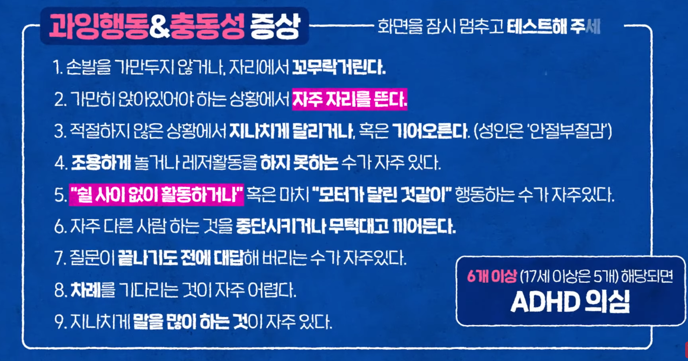

:hardbreaks:

= ADHD 주의력 결핍 및 과잉 행동 장애

Attention 주의
Deficit 결핍
Hyperactivity 과잉행동
Disorder 장애

== References

https://www.youtube.com/watch?v=4KCLRbcEVSU[[티처빌 인사이트\] 오은영 박사가 말하는 ADHD 오해와 진실 2021.07.26]

티처빌. 오은영

...

또래 아이들보다 너무 심하면, 남자 아이라도 문제!
ADHD는 여자 아이보다 남자 아이가 3~4배 더 많다.

오해4. 산만함은 개인의 특징이다. 치료해야 할 병이 아니다.
뇌의 전두엽과 일부 대뇌피질의 활성화의 이상으로 치료해야 하는 문제!

오해6. 산만하지 않으면 ADHD가 아니다.
행동이 산만하지 않은 조용한 ADHD도 있다.

https://www.youtube.com/watch?v=uPT1ka-gRNg[*ADHD 주전공* 오은영 박사가 알려주는 ADHD의 핵심 | 요즘 육아 금쪽같은 내새끼 15 회 2020.09.18]

...

ADHD 예시

돼지
...

충동성...

어떻게 될지 모르고 행동이 ...

기분이 어떤지 모르는 건 아닌데 못참고 말하는 거

정서적인 충동성 높음

고쳐주려고 지적, 지시, 강압적, 아이와 맞대응하고 화를 내면 아이하고는 전쟁

ADHD의 핵심. 조절과 억제

https://www.youtube.com/watch?v=MLIMLxxz4ek[[#육아지침서-15\] 산만한 우리 아이, 혹시 ADHD..? 2020.09.25]

자기 조절 및 불필요한 것들을 억제하는 기능의 획득이 잘 안되는 아이

1. 자기조절 능력
2. Inhibition 억제

...

약물치료가 효과적

https://www.youtube.com/watch?v=Ew7JGJPJiOY[＂나 너무 무서워.. 나 좀 안아줘..＂ ADHD 아이들이 느끼는 어려움 | 요즘 육아 금쪽같은 내새끼 15 회 2020.09.22]

아이라도 아이 마음의 주인은 아이 자신

https://www.youtube.com/watch?v=Hz0r6QQQ5d4[[미방분 - 육아교실\] 영•유아기 때부터 우리 아이가 ADHD인지 구별할 방법이 있다? | 요즘 육아 금쪽같은 내새끼 19 회 2020.10.16]

젖을 찔끔 빨고 산만

10개월 걷기 시작. 걷는 것보단 뛰는

발끝으로

날다람쥐처럼

3~5세 아이들은 원래 산만하고 미숙. ADHD구별이 어려움

https://www.youtube.com/watch?v=uQPhl9Zs8P8[아이가 예민하다고 생각할 때 우리가 꼭 알고있어야 할 것, 눈 맞춤 콘서트 마지막 사연! 2020.02.20]

오은영 TV

https://www.youtube.com/watch?v=1SN-U3kef98[ADHD에 대한 여러분의 편견 제가 깨보겠습니다 [최민준\] 2019.08.26]

https://www.youtube.com/watch?v=6jEMGxLLPU4[아이가 너무 산만하다면? 유형별 ADHD 자가진단법 공개☑️ (feat. 약물 치료) 정신건강의학과 신윤미 교수 [아주대병원TV\] 2021.03.04]

남자아이들이 2~3배 많음

조용한 ADHD - 주의력 결핍. 여자아이들이 우세

공상을 하거나 잘 못 챙기거나, 분실

발견이 늦어져서 치료가 늦어지는 경우가 많음.

왜 생기는 거?

신경 전달 물질의 화학적인 불균형

양육을 잘못하거나 잘못 먹이거나 심한 채벌 때문은 아님

부정적인 피드백. 자존감 떨어지고

2차적인 정서 문제가 생기는 것을 미연에 방지하기 위해 적절한 시기에 치료

몇 살쯤 검사를 받는게 좋을지?

초등학교 때 단체생활을 하며 발견하게 됨. 늦어도 초등학교 저학년 때 추천

Q3. 정신과 약물 복용에 대한 걱정

반응률이 가장 좋은 약

다른 치료법 보다 과학적으로 입증, 증상 호전

평생 먹어야? 보통 1년~2년. 증상 호전 정도 보고 휴지기를 갖고 평가를 갖고 쓸지 말지 결정.

약물 부작용. 약간의 불면증, 식욕 떨어짐, 머리가 아프거나 구토 증상

약을 조절해서 조절. 선생님들과 상의.

틱 증상, 경련성 질환이 있으면 악화될 가능성 높기때문에 반드시 조절

