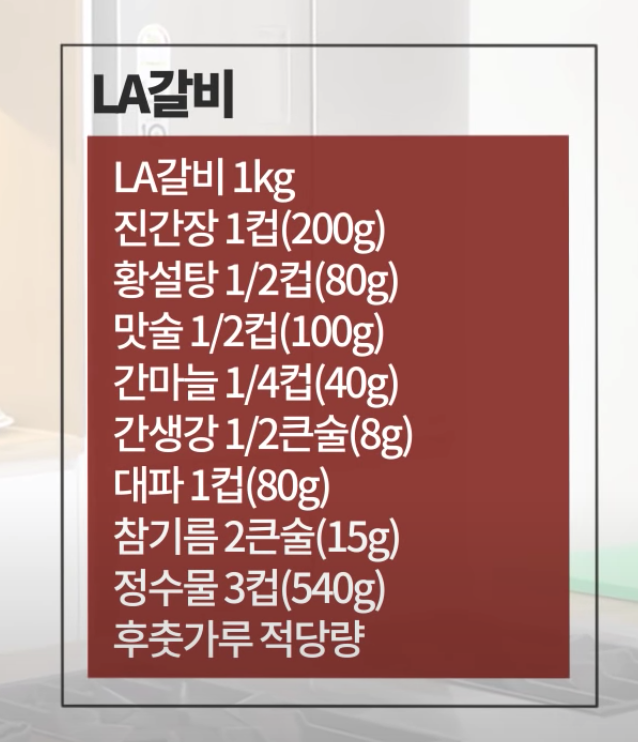

= LA갈비

== References
https://www.youtube.com/watch?v=37-BCf85bHk[설날 준비 LA갈비! ㅣ 백종원의 쿠킹로그 2020.01.21]

LA갈비 1kg
진간장 1컵(200g)
황설탕 1/2컵(80g)
맛술 1/2컵(100g)
간마늘 1/4컵(40g)
간생강 1/2큰술(8g)
대파 1컵(80g)
참기름 2큰술(15g)
정수물 3컵(540g)
후춧가루 적당량

흐르는 물에 갈비 씻기

담갔다 하면 뼈 사이에 있는 피가 빠지면서 좀 더 나음

30분~1시간 빼는게 좋음

배를 넣어서 향을 넣으면 더 맛있음. 배즙은 안됨. 한약맛 남.

물엿을 넣어도 되고.

간장 설탕 1:1 해도

꿀은 아카시아꿀

맛술 미향이나 미림. 다른 제품은 신맛 강함.

아니면 청하.

화이트페퍼 말고 블랙페퍼

지금 바로 먹을거면 양념 강하게.

양념 재우고 짜면 물 넣기

양념 최소한 2~3시간 재워두기.

양념이 탐. 살짝 물 넣고 굽기.

기름이 나와야 됨.

물로 기름을 녹이는거.

뼈옆에 끊어져야

