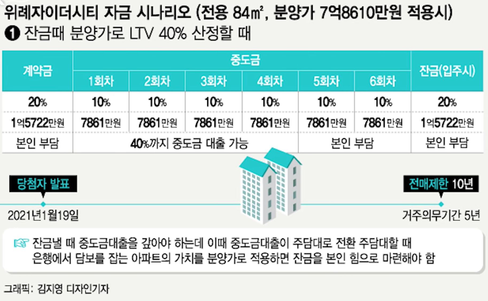

= 위례자이더시티 A2-6블록

http://wirye-xi-thecity.com/

* 경량충격음 차단성능 ⭐️⭐️⭐️⭐️
* 중량충격음 차단성능 ⭐️⭐️⭐️
* 세대간 경계벽의 차음성능 ⭐️⭐️⭐
* 외부소음. 교통소음(도로, 철도)에 대한 실내 외 소음 ⭐️
* 화장실 급배수소음 ⭐️

== [부릿지]위례자이더시티 모집공고를 분석해봤습니다
https://www.youtube.com/watch?v=9ILXqFrztRs

주자대수 1015대

공공분양 360세대
신혼희망타운 (분양) 293세대
신혼희망타운 (임대) ...

공공분양 3.3m2 당 2260만원

입주예정 2023년 3월

스타필드시티위례, 이마트트레이더스 가까움

복정역

2021.01.11 특별공급
2021.01.12 1순위 청약
2021.01.13 2순위 청약

https://www.youtube.com/watch?v=Z5pb0WPyY2I[위례자이더시티 | 오랜만에 시세차익 큰 단지 떴네요 2020.12.31]
