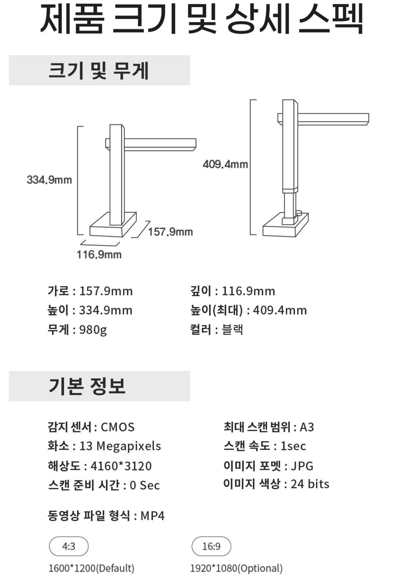
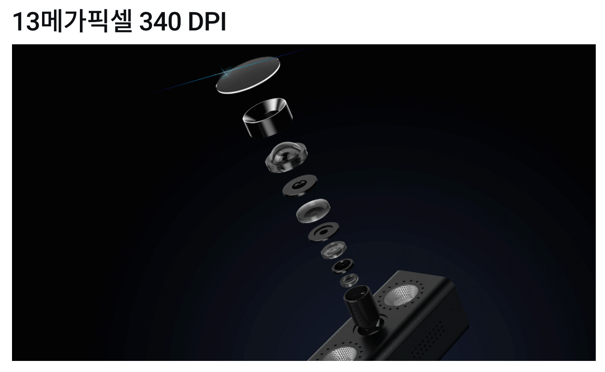

= 북스캐너

== CZUR ET18 Pro

http://www.ilovepc.co.kr/news/articleView.html?idxno=34862[잠들어있던 종이책을 전자책으로? 비파괴 북스캐너 살펴보기 2020.05.28]

https://coupa.ng/bSUtdO

1800만 카메라

핸드 버튼, 풋페달

HDMI

30프레임

ET16 1600만
ET18U 1800만
ET18 1800만

== Czur Shine Ultra

https://www.youtube.com/watch?v=hrBuKUelfEU[실용성 200%!! 가성비 비파괴식 북스캐너 - 시저 샤인 울트라 2020.09.14]

Aura 후속 제품

10만원대

https://www.wadiz.kr/web/campaign/detail/100611

AURA, AURA X, ET18PRO는 굴곡률 측정하는 레이저. 하드웨어 방식이지만. 샤인 울트라는 알고리즘으로 처리 해서 왜곡이 생길 수 있음.

13 Megapixels

13메가픽셀 340DPI

204,800원

== CZUR Shine 800 Pro

https://coupa.ng/bSUsoF

DPI: 210

== CZUR Shine 500 Pro

https://coupa.ng/bSUsi2

DPI: 270

== CZUR AURA

https://www.youtube.com/watch?v=8rACWCdzrnk[비파괴 북스캐너(CZUR AURA) 단점만 모아봤습니다. 2020.03.12]

화질 떨어짐

== CZUR AURA Pro

https://www.youtube.com/watch?v=dDVwE8IMap4[[파괴형 vs 비파괴형 스캐너\] 나에게 맞는 북 스캐너는? 2020.05.11]

비파괴. 비스듬.
손이 많이 감.

== Czur Aura X

https://www.youtube.com/watch?v=lWKHe5SiYXo[이거슨 신세계! 두꺼운 책 찢지않고 MS워드, PDF 전자책으로 대변신 ! 비파괴형 북스캐너 Aura X 사용 후기 feat. 아이패드 미니5 2019.09.19]

사이드 조명

OCR

