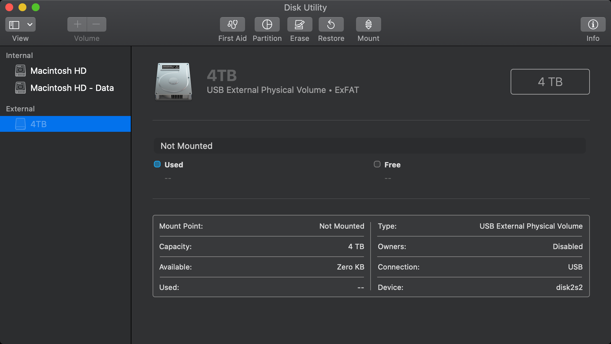

= exfat

윈도우와 OSX에서 외장 디스크를 같이 사용하려면 파일시스템을 FAT을 사용하는 것이 무난합니다. 다만 최대 용량 2TB의 제약이 있고 파일 하나의 최대사이즈는 4GB입니다.

ExFAT으로 사용하는게 무난합니다. 용량이 작은 파일만 사용할 경우 FAT을 사용하면

== OSX에서 exfat 정상 제거 안했을 때 인식 못하는 케이스
맥에서 exfat 외장하드를 그냥 뽑고 나면 다시 연결 하면 불만 껌뻑 거린다.

윈도우PC에 연결하면 복구가 진행됨. 용량에 따라 수분이 걸림.

맥에서 복구하려면 터미널에서 fsck_exfat 명령어를 직접 실행해서 복구합니다.

명령어에서 /dev/disk어쩌고 숫자는 Disk Utility에서 확인합니다.

image::image-2020-12-21-01-05-42-027.png[]

----
sudo fsck_exfat /dev/disk2s2
----

Resource Busy가 뜨면 자체적으로 검사를 진행하는 중인 것이니 끝날 때 까지 기다렸다고 다시 시도합니다.

clean 어쩌고 나오면 그냥 n

== 정리

== References
https://www.youtube.com/watch?v=tliH4RJEI3w[맥os에서 exfat 하드디스크 복구하기 | How to fix exfat drive on Mac]
