# 2020.02

## 2020.02.16 Ya, Gerald! Try something on me.
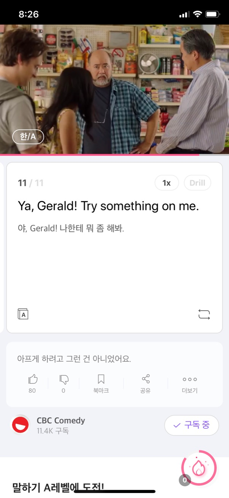
* Ya, Gerald! Try something on me.
* Ya, Gerald! Try something on me.
* Ya, Gerald! Try something on me.

## 2020.02.15 Hey, what you talking?
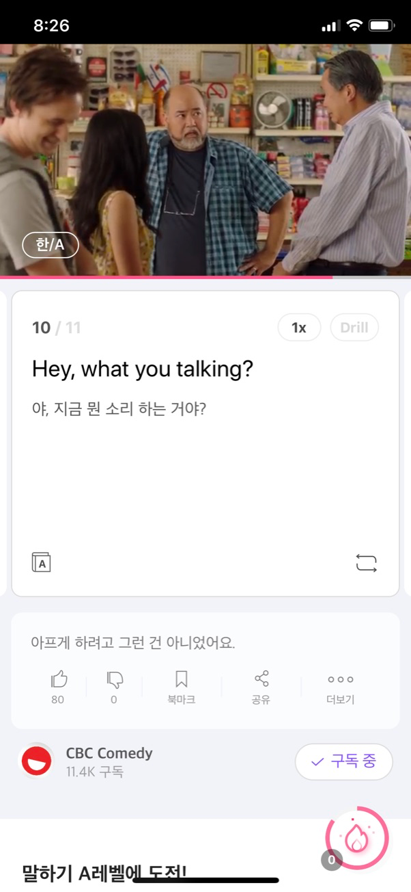
* Hey, what you talking?
* Hey, what you talking?
* Hey, what you talking?

## 2020.02.14 I'm getting older and weaker, just like your father here.
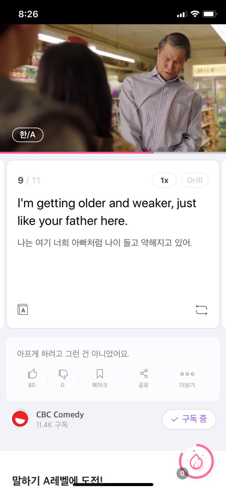
* I'm getting older and weaker, just like your father here.
* I'm getting older and weaker, just like your father here.
* I'm getting older and weaker, just like your father here.

## 2020.02.13 You have to be careful, Janet.
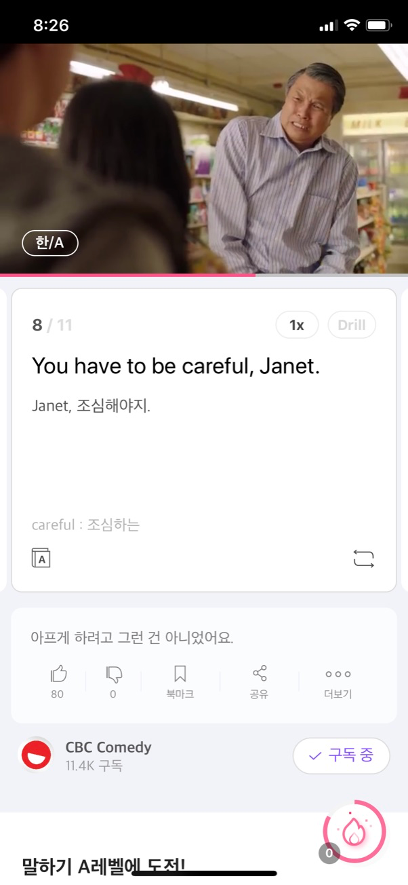
* You have to be careful, Janet.
* You have to be careful, Janet.
* You have to be careful, Janet.

## 2020.02.12 I didn't mean to hurt you.
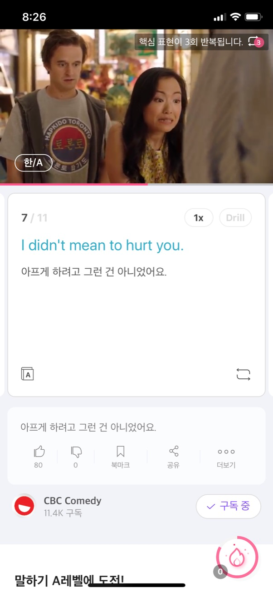
* I didn't mean to hurt you.
* I didn't mean to hurt you.
* I didn't mean to hurt you.

## 2020.02.11 Girl, that is so painful!
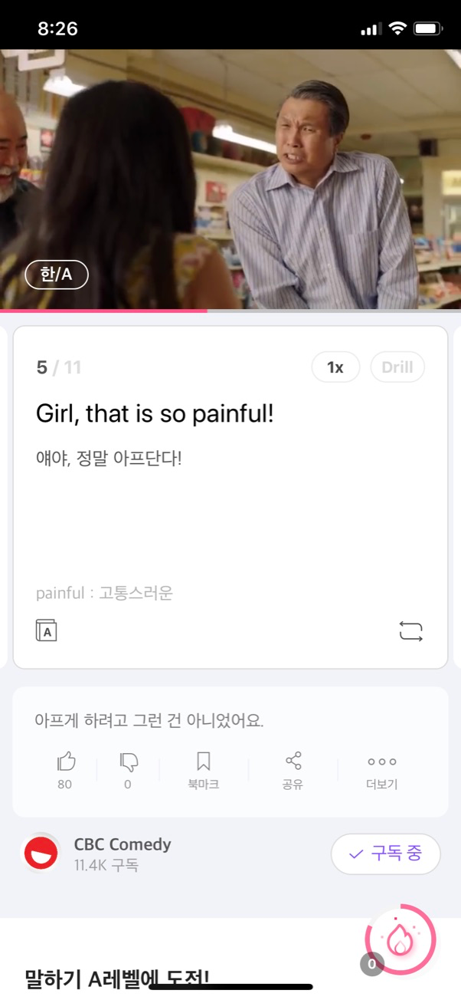
* Girl, that is so painful!
* Girl, that is so painful!
* Girl, that is so painful!

## 2020.02.10 Ahhhh!
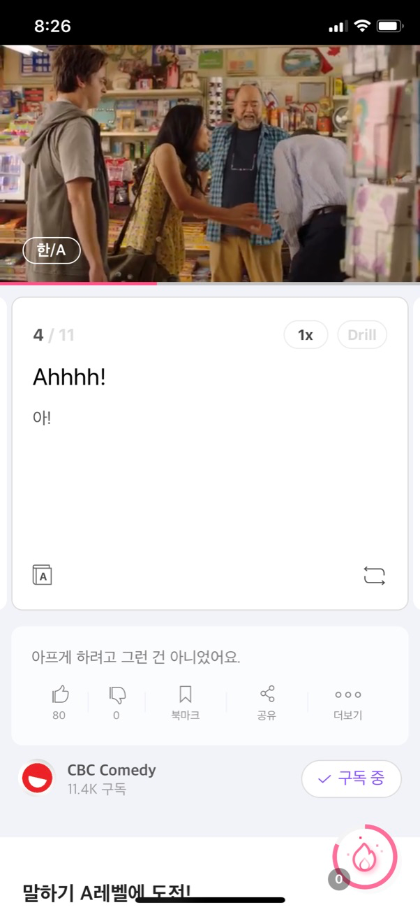
* Ahhhh!
* Ahhhh!
* Ahhhh!

## 2020.02.09 Grab me here, and then I just do...
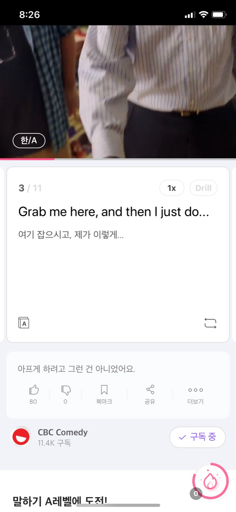
* Grab me here, and then I just do...
* Grab me here, and then I just do...
* Grab me here, and then I just do...

## 2020.02.08 Ah, so, this is wrist lock.
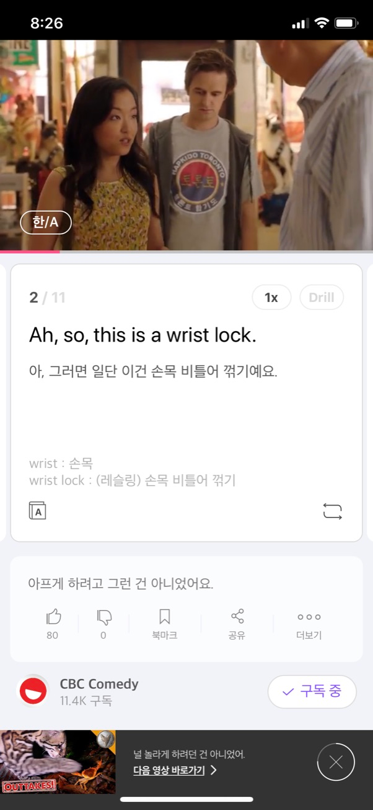
* Ah, so, this is wrist lock.
* Ah, so, this is wrist lock.
* Ah, so, this is wrist lock.

## 2020.02.07 Show us what you learned. Okay.
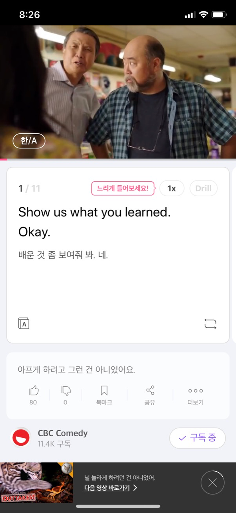
* Show us what you learned. Okay.
* Show us what you learned. Okay.
* Show us what you learned. Okay.

## 2020.02.06 Yeah. That's cool.
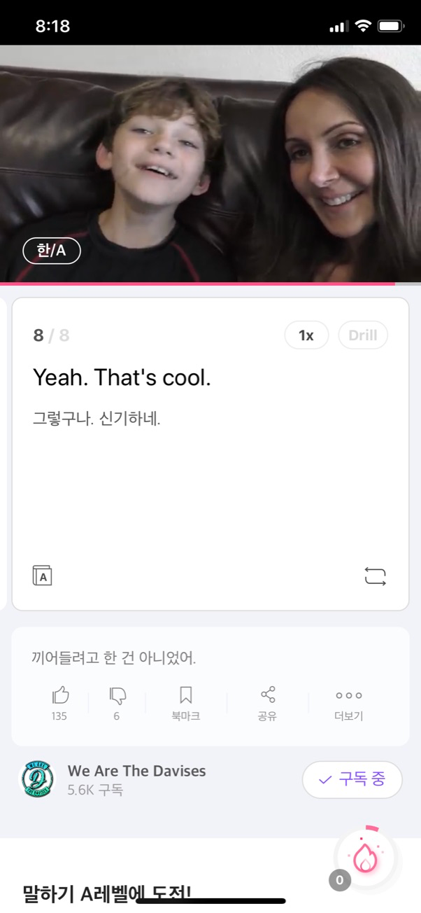
* Yeah. That's cool.
* Yeah. That's cool.
* Yeah. That's cool.

## 2020.02.05 Well, it's not really new, but I call it new because it's new.
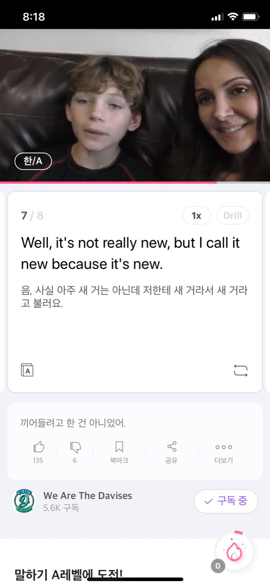
* Well, it's not really new, but I call it new because it's new.
* Well, it's not really new, but I call it new because it's new.
* Well, it's not really new, but I call it new because it's new.

## 2020.02.04 And I'm playin' a game on the, my new PS4.
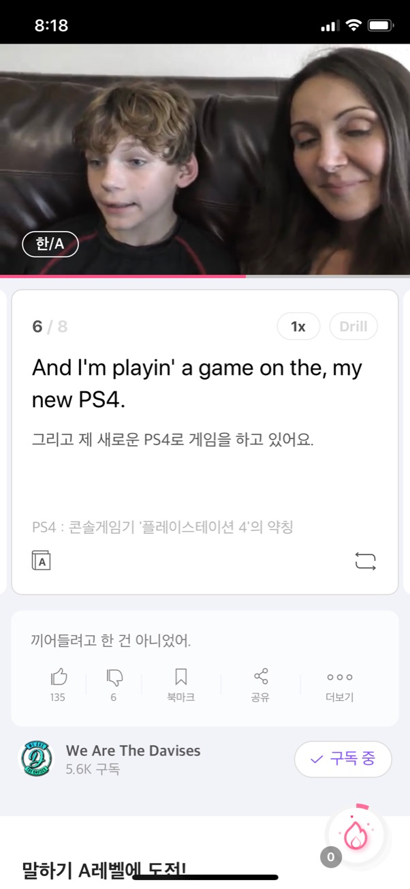
* And I'm playin' a game on the, my new PS4.
* And I'm playin' a game on the, my new PS4.
* And I'm playin' a game on the, my new PS4.

## 2020.02.03 I finished my homework at school, 'cause that's what I do.
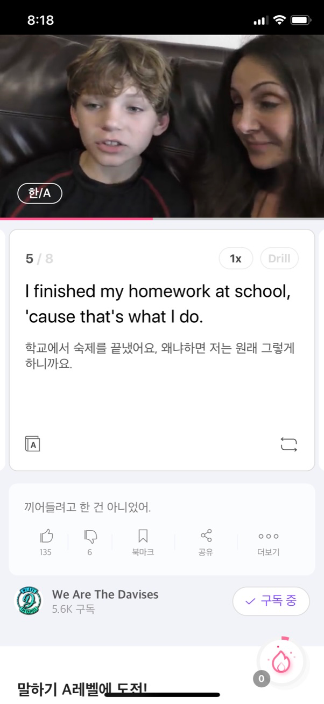
* I finished my homework at school, 'cause that's what I do.
* I finished my homework at school, 'cause that's what I do.
* I finished my homework at school, 'cause that's what I do.

## 2020.02.02 Sorry, I didn't mean to interrupt.
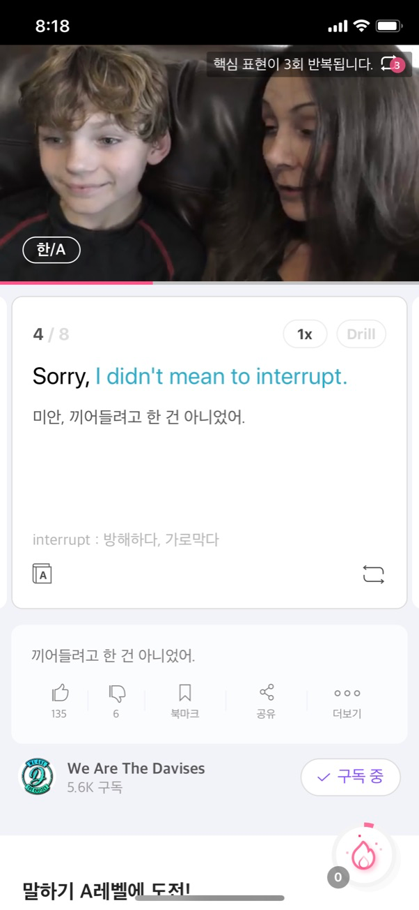
* Sorry, I didn't mean to interrupt.
* Sorry, I didn't mean to interrupt.
* Sorry, I didn't mean to interrupt.

## 2020.02.01 You did finished your homework. That's what I was gonna ask. Yep.
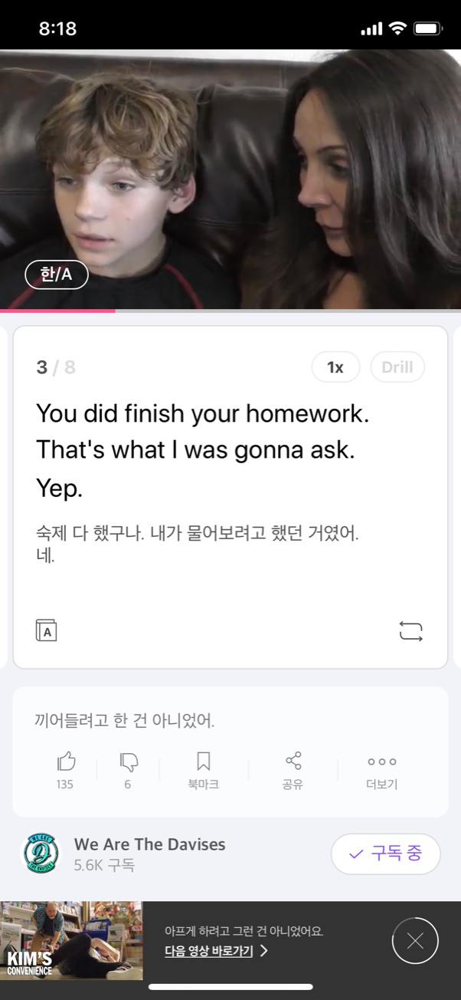
* You did finished your homework. That's what I was gonna ask. Yep.
* You did finished your homework. That's what I was gonna ask. Yep.
* You did finished your homework. That's what I was gonna ask. Yep.
