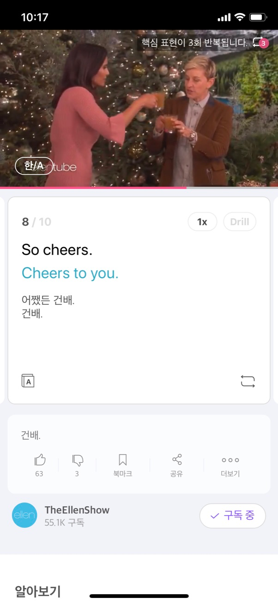

# Cake
* https://project100.kakao.com/project/56
* 
* ~2019.12.28

## 2020.01.06 109 I'm wearing my thermals right now.

* I'm wearing my thermals right now.
* I'm wearing my thermals right now.
* I'm wearing my thermals right now.

## 2020.01.05 108 I wonder if it's real.

* I wonder if it's real.
* I wonder if it's real.
* I wonder if it's real.

## 2020.01.04 107 I'm still walking on thin ice.

* I'm still walking on thin ice.
* I'm still walking on thin ice.
* I'm still walking on thin ice.

## 2020.01.03 106 You got everything?

* You got everything?
* You got everything?
* You got everything?

## 2020.01.02 105 Look what I got.

* Look what I got.
* Look what I got.
* Look what I got.

## 2020.01.01 104 I like getting older.

* I like getting older.
* I like getting older.
* I like getting older.

## 2019.12.31 103 Cheers to you.

* Cheers to you.
* Cheers to you.
* Cheers to you.

## 2019.12.30 102 I'm going to an end of the year party.

* I'm going to an end of the year party.
* I'm going to an end of the year party.
* I'm going to an end of the year party.

## 2019.12.29 101 I'd like to make a toast.

* I'd like to make a toast
* I'd like to make a toast.
* I'd like to make a toast.
