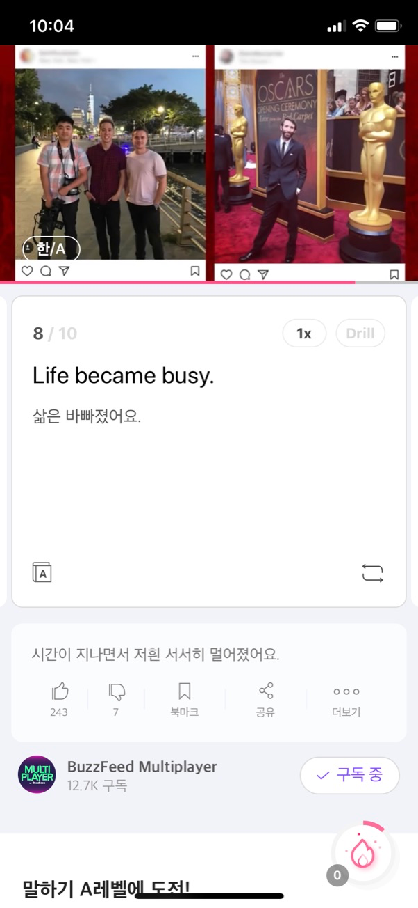
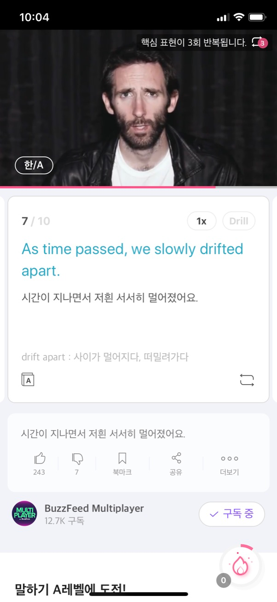
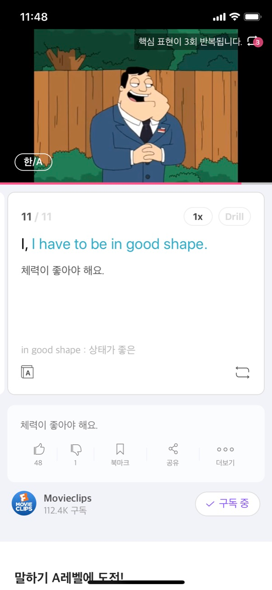

# Cake
* https://project100.kakao.com/project/56
* 
* ~2019.12.28

## 2020.01.29 Laughter became a memory.

* Laughter became a memory.
* Laughter became a memory.
* Laughter became a memory.

## 2020.01.28 Free time became scarce.

* Free time became scarce.
* Free time became scarce.
* Free time became scarce.

## 2020.01.27 Life became busy.

* Life became busy.
* Life became busy.
* Life became busy.

## 2020.01.26 At time passed, we slowly drifted apart.

* At time passed, we slowly drifted apart.
* At time passed, we slowly drifted apart.
* At time passed, we slowly drifted apart.

## 2020.01.25 We had what some people call a 'bromance'.

* We had what some people call a 'bromance'.
* We had what some people call a 'bromance'.
* We had what some people call a 'bromance'.

## 2020.01.24 We would grab dinner, see movies, and watch hockey games together.

* We would grab dinner, see movies, and watch hockey games together.
* We would grab dinner, see movies, and watch hockey games together.
* We would grab dinner, see movies, and watch hockey games together.

## 2020.01.23 Ben and I used to hang out at least three times a week.

* Ben and I used to hang out at least three times a week.
* Ben and I used to hang out at least three times a week.
* Ben and I used to hang out at least three times a week.

## 2020.01.22 So, we're closer than those two ever were.

* So, we're closer than those two ever were.
* So, we're closer than those two ever were.
* So, we're closer that those two ever were.

## 2020.01.21 To put that in perspective, Romeo and Juliet only knew each other for less than four days.

* To put that in perspective, Romeo and Juliet only knew each other for less than four days.
* To put that in perspective, Romeo and Juliet only knew each other for less than four days.
* To put that in perspective, Romeo and Juliet only knew each other for less than four days.

## 2020.01.20 My best friend Ben and I have known each other for two and a half years.

* My best friend Ben and I have known each other for two and a half years.
* My best friend Ben and I have known each other for two and a half years.
* My best friend Ben and I have known each other for two and a half years.

## 2020.01.19 I have to be in good shape.

* I have to be in good shape.
* I have to be in good shape.
* I have to be in good shape.
 
## 2020.01.18 I'm thinking about it.

* I'm thinking about it.
* I'm thinking about it.
* I'm thinking about it.

## 2020.01.17 Let's not overdo it.

* Let's not overdo it.
* Let's not overdo it.
* Let's not overdo it.

## 2020.01.16 Now that you mention it, that might just be possible.

* Now that you mention it, that might just be possible.
* Not that you mention it, that might just be possible.
* Not that you mention it, that might just be possible.

## 2020.01.15 Speaking of which, where is my wand?

* Speaking of which, where is my wand?
* Speaking of which, where is my wand?
* Speaking of which, where is my wand?

## 2020.01.14 Don't give up.

* Don't give up.
* Don't give up.
* Don't give up. 

## 2020.01.13 You're burning up.

* You're burning up.
* You're burning up.
* You're burning up.

## 2020.01.12 I think I'm coming down with the flu.

* I think I'm coming down with the flu.
* I think I'm coming down with the flu.
* I think I'm coming down with the flu.

## 2020.01.11 114 My bathroom break during the test took a little longer than anticipated.

* My bathroom break during the test took a little longer than anticipated.
* My bathroom break during the test took a little longer than anticipated.
* My bathroom break during the test took a little longer than anticipated.

## 2020.01.10 113 Way easier than you think.

* Way easier than you think.
* Way easier than you think.
* Way easier than you think.

## 2020.01.09 112 It is no joke. 

* It is no joke.
* It is no joke.
* It is no joke.

## 2020.01.08 111 I like her vocals.

* I like her vocals.
* I like her vocals.
* I like her vocals.

## 2020.01.07 110 Stop bothering me.

* Stop bothering me.
* Stop bothering me.
* Stop bothering me.

## 2020.01.06 109 I'm wearing my thermals right now.

* I'm wearing my thermals right now.
* I'm wearing my thermals right now.
* I'm wearing my thermals right now.

## 2020.01.05 108 I wonder if it's real.

* I wonder if it's real.
* I wonder if it's real.
* I wonder if it's real.

## 2020.01.04 107 I'm still walking on thin ice.

* I'm still walking on thin ice.
* I'm still walking on thin ice.
* I'm still walking on thin ice.

## 2020.01.03 106 You got everything?

* You got everything?
* You got everything?
* You got everything?

## 2020.01.02 105 Look what I got.

* Look what I got.
* Look what I got.
* Look what I got.

## 2020.01.01 104 I like getting older.

* I like getting older.
* I like getting older.
* I like getting older.

