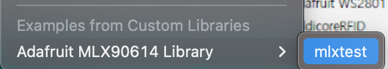

= 비접촉온도센서

== GY-906 MLX90614 Contactless Temperature Sensor Module
비접촉 온도 센서는 적외선 센서

=== Adafruit MLX90614 Library
https://github.com/adafruit/Adafruit-MLX90614-Library[Adafruit-MLX90614-Library]

Arduino Library Manager 에서 "Adafruit-MLX90614-Library" 검색

Examples from Custom libraries의 Adafruit MLX90614 Library -> mlxtest

https://www.devicemart.co.kr/goods/view?no=10918253[[SMG\] GY-906 비접촉 온도센서 모듈 MLX90614ESF [SZH-CH247\]]
* 2021.02.21 11,990원

https://www.aliexpress.com/item/32904859964.html[GY-906 MLX90614 Contactless Temperature Sensor Module]
* 2021.02.21 US $7.13 Shipping $2.32

== References
https://devicemart.blogspot.com/2019/07/10-mlx90614.html[[솔다/10분컷\] 아두이노 비접촉 온도센서 사용해보기 -MLX90614 모듈- 2019.07.11]
