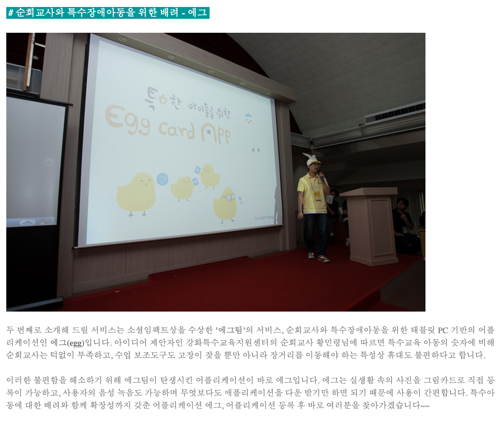

= Extracurricular Activities

* 24K / Hackathon / Thumbnail Making Tools / 2019
** Javascript
* SICAMP36 / Hackathon / Arrange art and place / 2017
** PHP, CodeIgniter, mysql
* SICAMP36 / Hackathon / Social Map / 2014
** PHP, CodeIgniter, mysql
* SICAMP Seoul / Hackathon / Social Game / 2013
** PHP, CodeIgniter, mysql
* SICAMP36 / Hackathon / Puzzle game for Handicapped child / 2012
** Android
* Hanulso / a club of Software Development / 2004 ~ 2012
** LED score maker / C / 2011
** English Study App / Android, QRCode / 2010
** Self-Balancing Robot / Lego, Andoird, Bluetooth / 2010
** Acupuncture Teaching App / Android, Bluetooth / 2010
** Support shopping App / Android, Sqlite, QRCode / 2009
** Club web page / PHP, MySQL / 2005
** Piano Game / WinAPI, DirectX, MIDI / 2005
** Photo Editing Tool / MFC / 2004
* University Project / 2004 ~2012
** Robot Control by Skeleton Tracking / MFC, Kinect / 2011
** AR Timetable / Android / 2011
** KNU SNS / PHP, MySQL, JavaScript / 2011

== 상세

=== 2019 카카오사내해카톤 24K

=== 2017 SICAMP36

Pick Art You

* http://www.datanet.co.kr/news/articleView.html?idxno=108346[다음세대재단, 2017 소셜이노베이션캠프36 성황리에 개최 2017.02.28]
* http://www.newsworks.co.kr/news/articleView.html?idxno=116313[다음세대재단, ‘2017 소셜이노베이션캠프 36’ 성료 2017.02.27]
* https://blog.kakaocorp.co.kr/599[우리가 잠든 사이 일어난 변화! 소셜이노베이션캠프 36 2017.]

=== 2014 SICAMP36
썸맵

http://changeon.org/%EC%9D%B8%ED%84%B0%EB%B7%B0-%EC%BB%A4%EB%AE%A4%EB%8B%88%ED%8B%B0-%EB%A7%A4%ED%95%91-%EC%84%9C%EB%B9%84%EC%8A%A4%EB%A5%BC-%EB%A7%8C%EB%93%A0-%EC%82%AC%EB%9E%8C%EB%93%A4-%EA%B9%80%EC%A4%80%ED%98%B8/[[인터뷰\] 커뮤니티 매핑 서비스를 만든 사람들, 김준호님 박동광님의 이야기 2015.03.02]

=== 2013 SICAMP Seoul

서울 지역 1등을 해서 Singapore 진출

https://www.facebook.com/sicampseoul/photos/a.147379498796833/178867242314725/[2013.12.07]

https://www.slideshare.net/sicampseoul/finger-town-via-sicamp-seoul[핑거타운(Finger town) 프리젠테이션 via SICAMPSEOUL2013 2013.10.13]
https://www.facebook.com/sicampasia/videos/635900139765165[Finger Town prototype. 2013.10.06]

https://www.facebook.com/sicampseoul/photos/?tab=album&album_id=169121093289340[동그라미재단에서 현재 핑거타운팀의 회의가 이루어지고 있습니다.^^]

=== 2012 SICAMP36

소셜임팩트상 수상

http://2012.sicamp36.org/bbs/board.php?bo_table=news&wr_id=559[[결과물\] 2012 소셜이노베이션캠프 36, 6개의 서비스 소개!! 2013.07.16]

